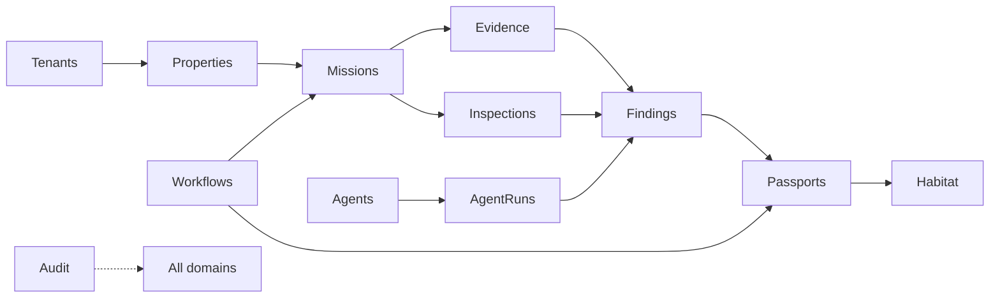
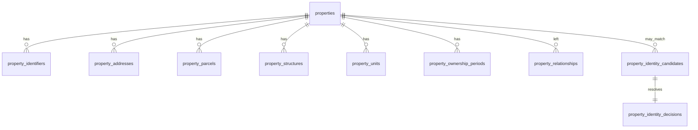
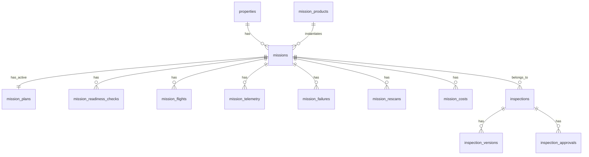
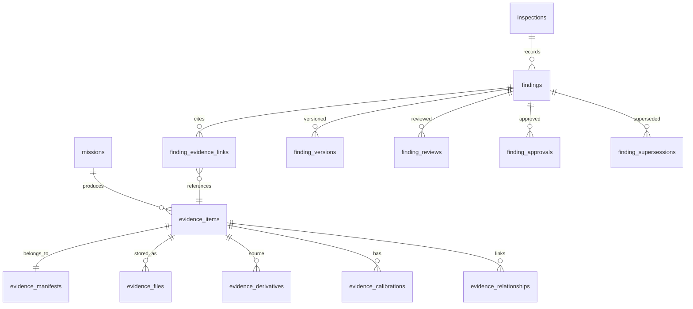
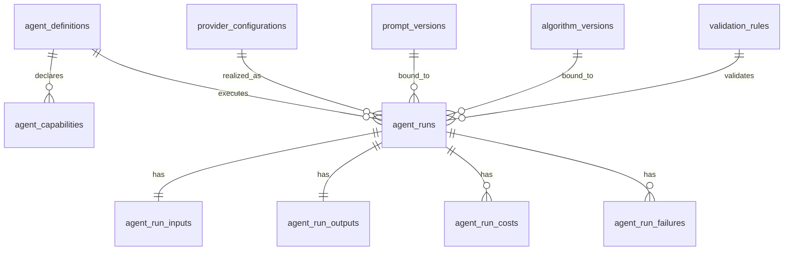
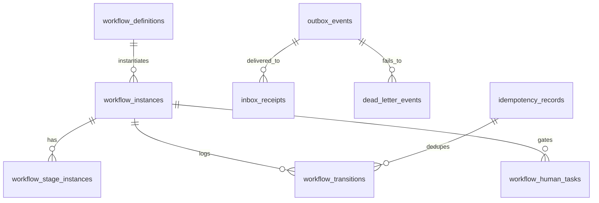
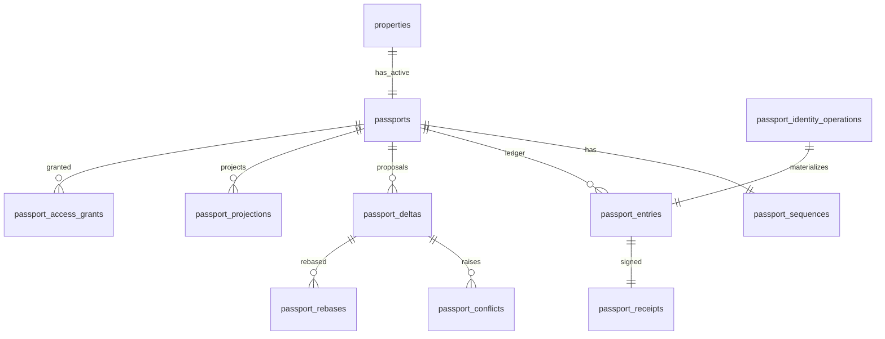
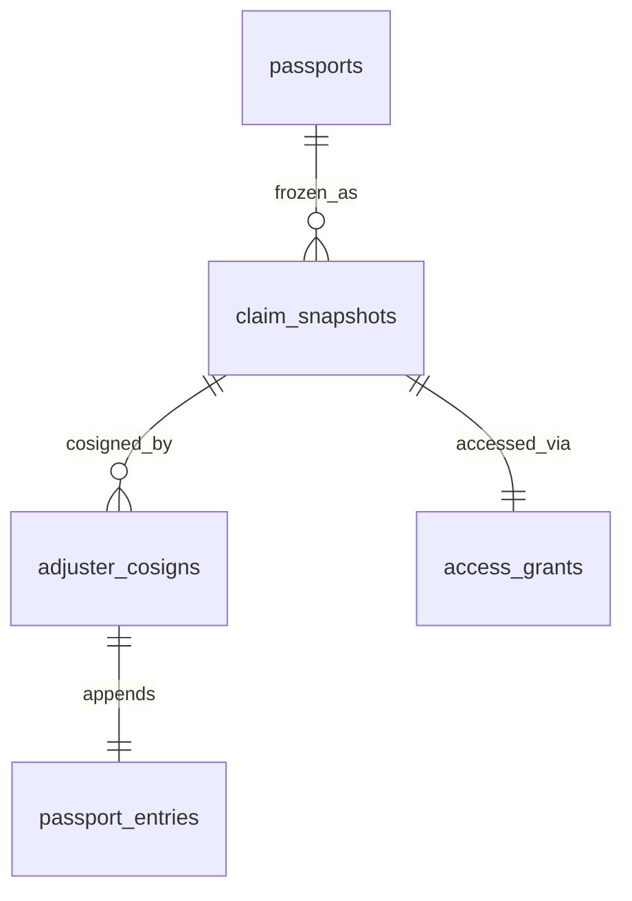
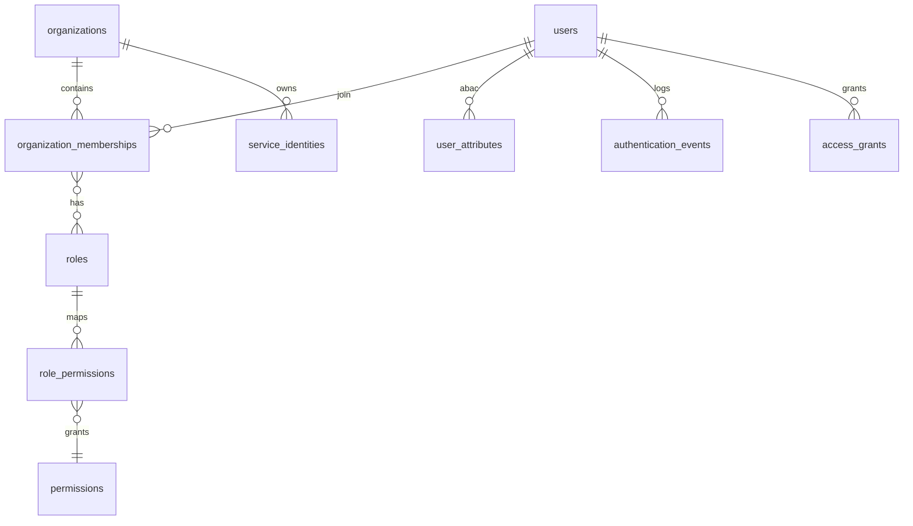
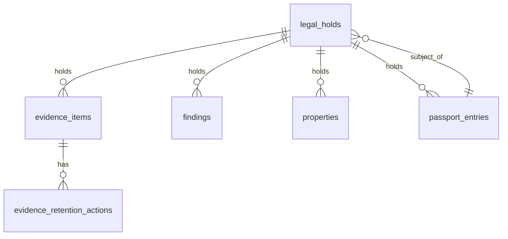

# STRATEX CORE — NEXTGEN CANONICAL DATA MODEL SPECIFICATION v1.0
**Status**: DRAFT · Awaiting Executive Review
**Classification**: CONFIDENTIAL — PROPRIETARY
**Created**: February 26, 2026
**Author**: TC · Stratex AI Product Manager, under Directive 003
**Reviewer**: Anthony Cross (Executive Architect)
**Aligned to**: Blueprint v1.2 · Sequence Diagrams Pack v1.0
**Preserves**: Blueprint v1.0, v1.1, v1.2 (unchanged)

> **Purpose.** Define the logical entities, fields, relationships, invariants, retention, and pragmatism boundaries required to support every flow in the Sequence Diagrams Pack v1.0. This is a **logical and relational specification only**. No migrations are authored. No production collection or table is created. Nothing is deployed.
>
> **Domain vs. service.** These ten domains are *logical*. They do not mandate ten databases or ten services. Physical topology is a deployment decision constrained by Blueprint v1.2 §4 (single MongoDB in Phase 1, Passport extraction in Phase 2).

---

## §1 — READING THIS SPECIFICATION

### §1.1 Universal field pattern

Every entity carries the following **standard audit block** unless otherwise stated:

| Field | Type | Required | Default | Notes |
|---|---|---|---|---|
| `_id` (canonical identifier) | ULID or UUIDv7 (string) | Yes | server-generated | Case-sensitive; monotonic; used in projections |
| `tenant_id` | organization_id (FK) | Yes | inherited | Every row is tenant-scoped except cross-tenant lookups explicitly noted |
| `created_at` | timestamp (UTC) | Yes | server clock | Immutable |
| `created_by` | user_id / service_id | Yes | session identity | Immutable |
| `updated_at` | timestamp (UTC) | Yes | server clock | Bumped on any write |
| `updated_by` | user_id / service_id | Yes | session identity | Bumped on any write |
| `version` | int | Yes | 1 | Optimistic-concurrency check-and-set |
| `soft_deleted_at` | timestamp \| null | No | null | Soft delete except entities explicitly marked *hard-delete only* or *no delete* |
| `retention_class` | enum | Yes | inherited from domain | See §11 |
| `pii_class` | enum | Yes | inherited from domain | See §11 |

Per-entity tables in §3–§12 list only the **entity-specific fields**; the standard audit block is implicit.

### §1.2 Notation

- **Type**: `string`, `int`, `float`, `bool`, `timestamp`, `enum`, `array<T>`, `object`, `FK(entity)`, `hash`, `uri`, `money`, `geo`, `measurement`
- **Required**: `Y` / `N`
- **Immutability**: `mut` (mutable), `imm` (immutable after first write), `sup` (mutable only via SUPERSEDE ledger entry)
- **Unique**: unique constraint (composite noted inline)
- **Index**: recommended index name / column
- **Retention**: see §11
- **PII**: `none` / `low` / `medium` / `high` / `restricted`

### §1.3 Writer/reader vocabulary

- **Sole writer**: exactly one logical service may INSERT/UPDATE.
- **Restricted writers**: named services.
- **Any tenant**: any authorized role within the tenant may write.
- **Read audience**: `internal`, `contractor`, `homeowner`, `adjuster`, `insurer`, `public_projection`, `regulator`.

### §1.4 Legal holds & soft delete

- Soft delete is the default; hard delete requires legal-basis rows in `retention_actions`.
- Any row with an active `legal_hold` cannot be soft- or hard-deleted.
- Passport ledger rows are **never** deleted; they may only be superseded (§10 invariants).

---

## §2 — SHARED VALUE OBJECTS

Reusable structures embedded in multiple entities. Value objects have no identity of their own except where noted.

### `Address`
```
line1: string(required)
line2: string?
city: string(required)
region: string  # state/province/prefecture
postal_code: string(required)
country_iso: enum(ISO-3166-1 alpha-2, required)
normalization_source: enum(user, geocoder, parcel_service, human_qa)
normalized: bool(required)
```

### `GeoCoordinate`
```
lat: float(-90..90, required)
lon: float(-180..180, required)
elevation_m: float?
precision_m: float(required, ≥ 0.5)   # precision floor per Blueprint §11.2
crs: enum(EPSG:4326, EPSG:3857, ...)
source: enum(gps, rtk, parcel, geocoder, manual)
captured_at: timestamp?
```

### `ParcelIdentifier`
```
jurisdiction: string(required)   # county/city id
parcel_number: string(required)
issued_at: timestamp?
source: enum(county_gis, contractor, imported)
```

### `Measurement`
```
value: float(required)
unit: enum(m, m2, m3, cm, ft, ft2, ft3, C, F, %, kWh, ...)  (required)
method: enum(measured, calculated, estimated, imported)  (required)
uncertainty: MeasurementUncertainty(required for measured/calculated)
provenance: Provenance(required)
```

### `MeasurementUncertainty`
```
absolute: float?
relative_pct: float?
confidence_interval_pct: float(0..100)?
notes: string?
```

### `Money`
```
amount: int  # minor units (cents)
currency: enum(ISO-4217, required)
```

### `DateTime` (UTC)
```
value: timestamp(required)
tz: string(IANA, required)
```

### `FileChecksum`
```
algorithm: enum(sha256, sha512, blake3)  (required)
value: hex-string(required)
computed_at: timestamp(required)
```

### `DigitalSignature`
```
algorithm: enum(sha256-hmac, ed25519, rsa-pss, ecdsa-secp256k1)  (required)
value: base64-string(required)
signer: user_id | service_id (required)
signed_at: timestamp(required)
```

### `Provenance`
```
provenance_type: enum(measured, calculated, estimated, imported, ai_assisted, human_entered)  (required)
evidence_ids: array<FK(evidence_items)>
agent_run_id: FK(agent_runs)?
reviewer: FK(users)?
reviewed_at: timestamp?
```

### `VerificationStatus`
```
status: enum(unreviewed, reviewed, verified, rejected, requires_field_verification)  (required)
reviewer: FK(users)?
reviewed_at: timestamp?
notes: string?
```

### `ImplementationState`
Blueprint §15.2:
```
enum(operational, partially_operational, mocked, planned, awaiting_credentials,
     awaiting_hardware, awaiting_validation, deprecated, legacy)
```

### `EvidenceAvailability`
```
enum(complete, partial, missing, contradictory)
```

### `Confidence`
```
value_pct: int(0..100)
scope: enum(model, aggregate_finding)
```

### `TruthScoreBand`
Blueprint §15.3:
```
enum(10_bands)   # discrete 10-point bands only; never decimals
```

### `RiskTier`
```
enum(tier_1_automated_informational, tier_2_contractor_review,
     tier_3_high_consequence_non_engineering, tier_4_engineering_controlled)
```

### `ProductEntitlement`
```
product: enum(dayscan, awe_scan, elite)
scope: enum(mission, property, org)
capabilities: array<enum>
```

### `RetentionPolicy`
```
class: enum(passport_ledger, raw_evidence, derived_model, temp_working, pii,
            auth_log, ai_run, customer_export, tombstoned)
hot_days: int
cold_days: int
tombstone_days: int
legal_hold_active: bool
```

### `LegalHold`
```
hold_id: string
reason_code: string
active: bool
applied_at: timestamp
released_at: timestamp?
```

### `AccessScope`
```
audience: enum(public, homeowner, contractor, adjuster, insurer, regulator, internal)
redaction_profile: string  # named profile
ttl_seconds: int
binding: string?   # recipient email / org
```

### `IdentityOperationReceipt`
```
op_type: enum(IDENTITY_LINK, IDENTITY_UNLINK, IDENTITY_MERGE, IDENTITY_SPLIT,
              ADDRESS_CORRECTION, PARCEL_CORRECTION, OWNERSHIP_TRANSFER, SUPERSEDE_FINDING, COSIGN)
signature: DigitalSignature
prior_hash: hex-string?
new_hash: hex-string
seq: int
```

---

## §3 — DOMAIN 1: TENANTS AND IDENTITY

Sole authority for organizations, users, memberships, roles, MFA factors, and access grants.

### `organizations`
| Field | Type | Req | Immut | Notes |
|---|---|---|---|---|
| `name` | string | Y | mut | Unique per jurisdiction |
| `legal_name` | string | N | mut | |
| `jurisdiction` | string | Y | mut | ISO-3166-2 |
| `status` | enum(active, suspended, closed) | Y | mut | |
| `contact_email` | string | Y | mut | PII: medium |
| `contact_phone` | string | N | mut | PII: medium |
| `billing_status` | enum(good, hold, delinquent) | Y | mut | |
| `feature_flags` | object | N | mut | |
| `attributes` | object | N | mut | ABAC facts |

- **Unique**: `(name, jurisdiction)`; `contact_email`
- **Indexes**: `jurisdiction`, `status`
- **Writers**: admin_service (during onboarding), admin role
- **Readers**: internal
- **Retention**: `pii` for `contact_*`; `passport_ledger` for `_id`
- **PII**: medium (contact fields)

### `users`
| Field | Type | Req | Immut | Notes |
|---|---|---|---|---|
| `email` | string (unique) | Y | mut | PII: high |
| `full_name` | string | Y | mut | PII: medium |
| `phone` | string | N | mut | PII: medium |
| `status` | enum(active, suspended, closed) | Y | mut | |
| `identity_provider` | enum(local, oidc, saml) | Y | imm | |
| `primary_org_id` | FK(organizations) | Y | mut | |
| `attributes` | object | N | mut | ABAC facts |

- **Unique**: `email`
- **Indexes**: `primary_org_id`, `status`
- **Writers**: identity service
- **Readers**: internal
- **PII**: high

### `organization_memberships`
| Field | Type | Req | Immut | Notes |
|---|---|---|---|---|
| `user_id` | FK(users) | Y | imm | |
| `organization_id` | FK(organizations) | Y | imm | |
| `role_ids` | array<FK(roles)> | Y | mut | |
| `attributes` | object | N | mut | ABAC |
| `status` | enum(active, revoked) | Y | mut | |

- **Unique**: `(user_id, organization_id)`
- **Indexes**: `organization_id`, `user_id`
- **Writers**: admin role in target org
- **PII**: none

### `roles`
| Field | Type | Req | Notes |
|---|---|---|---|
| `key` | string | Y | Well-known: admin, contractor, pilot, inspector, homeowner, adjuster, engineer_reviewer, service |
| `display_name` | string | Y | |
| `is_system` | bool | Y | System roles cannot be deleted |

### `permissions`
| Field | Type | Req | Notes |
|---|---|---|---|
| `key` | string | Y | e.g. `passport.append`, `finding.approve.tier3` |
| `resource` | string | Y | |
| `action` | string | Y | |

### `role_permissions`
| Field | Type | Req | Notes |
|---|---|---|---|
| `role_id` | FK(roles) | Y | |
| `permission_id` | FK(permissions) | Y | |

- **Unique**: `(role_id, permission_id)`

### `user_attributes`
Free-form ABAC facts for property-level scoping.
| Field | Type | Req | Notes |
|---|---|---|---|
| `user_id` | FK(users) | Y | |
| `key` | string | Y | e.g. `property_org_binding` |
| `value` | string | Y | |
| `source` | enum(admin, self, integration) | Y | |
| `granted_at` | timestamp | Y | |

### `service_identities`
| Field | Type | Req | Notes |
|---|---|---|---|
| `service_key` | string | Y | Well-known: passport, sync, retention, orchestrator |
| `credential_hash` | hex | Y | never store plaintext |
| `status` | enum(active, rotating, revoked) | Y | |
| `rotation_last_at` | timestamp | N | |

### `authentication_events`
| Field | Type | Req | Notes |
|---|---|---|---|
| `user_id` | FK(users)? | | |
| `service_id` | FK(service_identities)? | | |
| `event_type` | enum(login_ok, login_fail, mfa_ok, mfa_fail, step_up_ok, step_up_fail, token_issue, token_revoke) | Y | |
| `ip` | string | Y | |
| `user_agent` | string | N | |
| `at` | timestamp | Y | |

- **Retention**: `auth_log`
- **PII**: medium

### `access_grants`
Passport-external access grants (see SD-022).
| Field | Type | Req | Notes |
|---|---|---|---|
| `grantor_user_id` | FK(users) | Y | |
| `scope` | AccessScope | Y | |
| `target_resource` | string | Y | e.g. `passport:<id>` |
| `expires_at` | timestamp | Y | |
| `revoked_at` | timestamp? | | |
| `kill_list_key` | string | Y | server-generated; used on every access |

- **Indexes**: `target_resource`, `expires_at`
- **Retention**: `auth_log`

---

## §4 — DOMAIN 2: PROPERTIES

Canonical identity for the physical property. Ownership is *not* identity (§10 invariants).

### `properties`
| Field | Type | Req | Immut | Notes |
|---|---|---|---|---|
| `canonical_id` | ULID | Y | imm | The Passport identity token |
| `status` | enum(active, superseded, merged_into, split_from) | Y | mut | Non-destructive lifecycle |
| `superseded_by_id` | FK(properties)? | N | sup | |
| `truth_score_band` | TruthScoreBand | Y | mut | 10-point bands only |

- **Unique**: `canonical_id`
- **Retention**: `passport_ledger`

### `property_identifiers`
Composite identity slot values that establish canonical identity.
| Field | Type | Req | Immut | Notes |
|---|---|---|---|---|
| `property_id` | FK(properties) | Y | imm | |
| `slot` | enum(address, parcel, coordinate, unit, jurisdiction, boundary) | Y | imm | |
| `value_hash` | hex | Y | imm | hash of normalized value for equality |
| `active` | bool | Y | mut | False after supersede |

- **Unique**: `(property_id, slot)` where `active=true`

### `property_addresses`
| Field | Type | Req | Immut | Notes |
|---|---|---|---|---|
| `property_id` | FK(properties) | Y | imm | |
| `address` | Address | Y | sup | Corrections via SUPERSEDE |
| `active_from` | timestamp | Y | imm | |
| `active_to` | timestamp? | | mut | Set on supersede |

### `property_parcels`
| Field | Type | Req | Immut | Notes |
|---|---|---|---|---|
| `property_id` | FK(properties) | Y | imm | |
| `parcel` | ParcelIdentifier | Y | sup | |
| `active` | bool | Y | mut | |

### `property_structures`
Optional structure-level detail (accessory buildings).
| Field | Type | Req | Notes |
|---|---|---|---|
| `property_id` | FK(properties) | Y | |
| `structure_type` | enum(primary_dwelling, adu, garage, shed, outbuilding, other) | Y | |
| `polygon` | geo(polygon) | Y | |
| `attributes` | object | N | |

### `property_units`
Distinct identity slot for multi-unit buildings.
| Field | Type | Req | Notes |
|---|---|---|---|
| `parent_property_id` | FK(properties) | Y | |
| `unit_property_id` | FK(properties) | Y | Its own canonical id |
| `unit_label` | string | Y | |
| `stack_position` | object | N | floor / stack notation |

- **Unique**: `(parent_property_id, unit_label)`

### `property_identity_candidates`
Duplicate-detection candidate list (SD-002).
| Field | Type | Req | Notes |
|---|---|---|---|
| `submission_id` | string | Y | groups a resolution attempt |
| `candidate_property_id` | FK(properties) | Y | |
| `score` | float(0..1) | Y | |
| `signals` | object | Y | matched slots |
| `decision` | enum(auto_match, review, reject)? | | |

- **Indexes**: `submission_id`

### `property_identity_decisions`
Human-QA outcomes for identity conflicts.
| Field | Type | Req | Notes |
|---|---|---|---|
| `submission_id` | string | Y | |
| `decided_by` | FK(users) | Y | |
| `decision` | enum(link_existing, create_new, merge_into, split_from, reject) | Y | |
| `decided_at` | timestamp | Y | |
| `notes` | string | N | |

### `property_ownership_periods`
Ownership records — never property identity.
| Field | Type | Req | Immut | Notes |
|---|---|---|---|---|
| `property_id` | FK(properties) | Y | imm | |
| `owner_user_id` | FK(users) | Y | imm | |
| `role` | enum(owner, occupant) | Y | imm | |
| `starts_at` | timestamp | Y | imm | |
| `ends_at` | timestamp? | | mut | |
| `transfer_authorization_id` | FK(passport_identity_operations)? | | imm | |

### `property_relationships`
Parent-child / linked property associations.
| Field | Type | Req | Notes |
|---|---|---|---|
| `left_property_id` | FK(properties) | Y | |
| `right_property_id` | FK(properties) | Y | |
| `relationship` | enum(parent_of, child_of, linked_via_parcel, linked_via_hoa, linked_via_portfolio) | Y | |
| `established_at` | timestamp | Y | |

---

## §5 — DOMAIN 3: MISSIONS

### `missions`
| Field | Type | Req | Immut | Notes |
|---|---|---|---|---|
| `property_id` | FK(properties) | Y | imm | Canonical identity |
| `product_id` | FK(mission_products) | Y | imm | |
| `state` | enum(planned, validated, in_flight, capture_finalized, processing, awaiting_qa, reported, closed, failed, canceled) | Y | mut | |
| `pilot_user_id` | FK(users)? | | mut | |
| `dispatcher_user_id` | FK(users) | Y | mut | |
| `stage` | enum(1..15) | Y | mut | matches Blueprint §22 |
| `parent_failed_mission_id` | FK(missions)? | | imm | rescan link |
| `price` | Money | Y | imm | contractor price |
| `estimated_cost` | Money | Y | mut | internal, recorded to ledger |

- **Indexes**: `property_id`, `state`, `pilot_user_id`, `stage`

### `mission_products`
Catalog of DayScan / AWE / Elite.
| Field | Type | Req | Notes |
|---|---|---|---|
| `product_key` | enum(dayscan, awe_scan, elite) | Y | |
| `version` | string | Y | product policy version |
| `capture_conditions` | object | Y | day/night, env delta |
| `sensor_requirements` | object | Y | rgb, thermal, gps |
| `human_qa_tier` | RiskTier | Y | |
| `report_template` | string | Y | |
| `contractor_price` | Money | Y | |
| `internal_cost_estimate` | Money | Y | |
| `rescan_rules` | object | Y | |
| `failed_mission_policy` | object | Y | |
| `habitat_entitlement` | ProductEntitlement | Y | |

- **Unique**: `(product_key, version)`

### `mission_requirements`
Concrete requirements captured at mission-creation time (deep-copy for immutability).
| Field | Type | Req | Notes |
|---|---|---|---|
| `mission_id` | FK(missions) | Y | |
| `snapshot` | object | Y | frozen policy at mission creation |

### `mission_plans`
| Field | Type | Req | Notes |
|---|---|---|---|
| `mission_id` | FK(missions) | Y | |
| `plan_version` | int | Y | |
| `route` | geo(linestring/polygon) | Y | |
| `altitude_profile` | object | Y | |
| `sensor_plan` | object | Y | |
| `time_windows` | object | Y | |
| `pilot_acceptance_at` | timestamp? | | |
| `status` | enum(draft, submitted, accepted, rejected) | Y | |

- **Unique**: `(mission_id, plan_version)`

### `mission_readiness_checks`
| Field | Type | Req | Notes |
|---|---|---|---|
| `mission_id` | FK(missions) | Y | |
| `pass` | bool | Y | |
| `items` | array<object> | Y | one entry per ATC item |
| `overrides` | array<object> | Y | pilot-acknowledged warnings |
| `evaluated_at` | timestamp | Y | |

### `mission_environment`
| Field | Type | Req | Notes |
|---|---|---|---|
| `mission_id` | FK(missions) | Y | |
| `forecast` | object | Y | |
| `observed` | object | Y | temp, humidity, wind, solar |
| `awe_delta_ok` | bool | Y | AWE eligibility |

### `mission_equipment`
| Field | Type | Req | Notes |
|---|---|---|---|
| `mission_id` | FK(missions) | Y | |
| `drone_serial` | string | Y | |
| `sensor_configuration` | object | Y | intrinsics + calibration references |
| `edge_compute` | object | N | Manifold or equivalent |

### `mission_flights`
| Field | Type | Req | Notes |
|---|---|---|---|
| `mission_id` | FK(missions) | Y | |
| `started_at` | timestamp | Y | |
| `completed_at` | timestamp? | | |
| `outcome` | enum(completed, aborted, insufficient) | Y | |
| `retake_count` | int | Y | |

### `mission_telemetry`
High-volume; partition-candidate.
| Field | Type | Req | Notes |
|---|---|---|---|
| `mission_id` | FK(missions) | Y | |
| `frame_index` | int | Y | |
| `position` | GeoCoordinate | Y | |
| `attitude` | object | Y | roll/pitch/yaw |
| `at` | timestamp | Y | |

- **Indexes**: `(mission_id, frame_index)`
- **Retention**: `raw_evidence`

### `mission_failures`
| Field | Type | Req | Notes |
|---|---|---|---|
| `mission_id` | FK(missions) | Y | |
| `class` | enum(environmental, operator, hardware, insufficient_evidence, processing, cancellation) | Y | |
| `reason_codes` | array<string> | Y | |
| `notes` | string | N | |

### `mission_rescans`
| Field | Type | Req | Notes |
|---|---|---|---|
| `failed_mission_id` | FK(missions) | Y | |
| `new_mission_id` | FK(missions) | Y | |
| `policy_applied` | string | Y | |

### `mission_costs`
| Field | Type | Req | Notes |
|---|---|---|---|
| `mission_id` | FK(missions) | Y | |
| `cost_class` | enum(compute, provider, storage, human_qa, ops) | Y | |
| `amount` | Money | Y | |
| `at` | timestamp | Y | |

- **Indexes**: `mission_id`, `at`

---

## §6 — DOMAIN 4: INSPECTIONS

### `inspections`
An inspection is the review-and-approval envelope around one or more missions on a property.
| Field | Type | Req | Immut | Notes |
|---|---|---|---|---|
| `property_id` | FK(properties) | Y | imm | |
| `product` | enum(dayscan, awe_scan, elite) | Y | imm | |
| `status` | enum(draft, awaiting_qa, approved, rejected, superseded) | Y | mut | |
| `owner_user_id` | FK(users) | Y | mut | |
| `elite_link_id` | FK(inspections)? | | imm | For Elite pairing |

### `inspection_versions`
| Field | Type | Req | Notes |
|---|---|---|---|
| `inspection_id` | FK(inspections) | Y | |
| `version` | int | Y | |
| `content_hash` | hex | Y | |
| `created_at` | timestamp | Y | |

- **Unique**: `(inspection_id, version)`

### `inspection_participants`
| Field | Type | Req | Notes |
|---|---|---|---|
| `inspection_id` | FK(inspections) | Y | |
| `user_id` | FK(users) | Y | |
| `role_at_inspection` | enum(contractor, inspector, pilot, tier2_qa, tier3_qa, tier4_engineer, adjuster) | Y | |

### `inspection_status_history`
| Field | Type | Req | Notes |
|---|---|---|---|
| `inspection_id` | FK(inspections) | Y | |
| `from_status` | string | Y | |
| `to_status` | string | Y | |
| `by_user_id` | FK(users) | Y | |
| `at` | timestamp | Y | |

### `inspection_approvals`
| Field | Type | Req | Notes |
|---|---|---|---|
| `inspection_id` | FK(inspections) | Y | |
| `tier` | RiskTier | Y | |
| `approver_user_id` | FK(users) | Y | |
| `signature` | DigitalSignature | Y | |

### `inspection_property_links`
| Field | Type | Req | Notes |
|---|---|---|---|
| `inspection_id` | FK(inspections) | Y | |
| `property_id` | FK(properties) | Y | |
| `link_kind` | enum(primary, elite_pair, unit_of) | Y | |

---

## §7 — DOMAIN 5: EVIDENCE

### `evidence_items`
Logical unit — one photograph, one radiometric capture, one telemetry file.
| Field | Type | Req | Immut | Notes |
|---|---|---|---|---|
| `mission_id` | FK(missions) | Y | imm | |
| `kind` | enum(rgb_original, rjpg_radiometric, video, flight_log, telemetry, calibration, environment, note) | Y | imm | |
| `role` | enum(source_of_truth, derivative) | Y | imm | Blueprint §14 |
| `content_hash` | FileChecksum | Y | imm | idempotency key |
| `size_bytes` | int | Y | imm | |
| `captured_at` | timestamp | Y | imm | |
| `availability` | EvidenceAvailability | Y | mut | |

- **Unique**: `content_hash` per mission
- **Indexes**: `(mission_id, kind, role)`

### `evidence_files`
Physical storage locators (tenant-isolated per §9.4).
| Field | Type | Req | Notes |
|---|---|---|---|
| `evidence_item_id` | FK(evidence_items) | Y | |
| `storage_uri` | uri | Y | tenant-scoped |
| `encryption_context` | string | Y | |
| `signed_url_policy` | string | Y | |

### `evidence_manifests`
| Field | Type | Req | Notes |
|---|---|---|---|
| `mission_id` | FK(missions) | Y | |
| `manifest_hash` | FileChecksum | Y | over the whole manifest |
| `finalized_at` | timestamp | Y | |
| `item_count` | int | Y | |

- **Unique**: `manifest_hash`

### `evidence_checksums`
Long-lived integrity records that outlive derivatives.
| Field | Type | Req | Notes |
|---|---|---|---|
| `evidence_item_id` | FK(evidence_items) | Y | |
| `algorithm` | enum(sha256, sha512, blake3) | Y | |
| `value` | hex | Y | |
| `verified_at` | timestamp | N | recomputed on lifecycle transition |

### `evidence_metadata`
Sensor + capture metadata (deep-copy of EXIF + custom).
| Field | Type | Req | Notes |
|---|---|---|---|
| `evidence_item_id` | FK(evidence_items) | Y | |
| `intrinsics` | object | Y | camera model, distortion |
| `pose` | object | N | |
| `range_m` | float | N | |
| `environmental` | object | Y | temperature, humidity, solar loading |

### `evidence_calibrations`
| Field | Type | Req | Notes |
|---|---|---|---|
| `evidence_item_id` | FK(evidence_items) | Y | |
| `calibration_source_id` | FK(evidence_items)? | | calibration frames |
| `residual` | object | Y | |
| `method` | string | Y | |

### `evidence_derivatives`
Anything derived from originals (twin, PDF, textures).
| Field | Type | Req | Immut | Notes |
|---|---|---|---|---|
| `source_evidence_ids` | array<FK(evidence_items)> | Y | imm | |
| `derivative_kind` | enum(twin_gltf, twin_ifc, twin_dxf, twin_ply, twin_e57, report_pdf, thumbnail, thermal_reprojection, projection_texture) | Y | imm | |
| `content_hash` | FileChecksum | Y | imm | |
| `agent_run_id` | FK(agent_runs)? | | imm | derivation lineage |

### `evidence_relationships`
| Field | Type | Req | Notes |
|---|---|---|---|
| `left_id` | FK(evidence_items) | Y | |
| `right_id` | FK(evidence_items) | Y | |
| `relationship` | enum(paired_rgb_thermal, replaced_by, cross_calibration_of) | Y | |

### `evidence_access_logs`
Every retrieval writes here (SD-016, SD-022).
| Field | Type | Req | Notes |
|---|---|---|---|
| `evidence_item_id` | FK(evidence_items) | Y | |
| `by_user_id` | FK(users)? | | |
| `via_grant_id` | FK(access_grants)? | | |
| `at` | timestamp | Y | |

- **Retention**: `auth_log`

### `evidence_retention_actions`
| Field | Type | Req | Notes |
|---|---|---|---|
| `evidence_item_id` | FK(evidence_items) | Y | |
| `action` | enum(hot_to_cold, cold_to_archive, tombstone, restore) | Y | |
| `reason_code` | string | Y | |
| `at` | timestamp | Y | |
| `by` | FK(users) | service_id | Y | |

### `legal_holds`
| Field | Type | Req | Notes |
|---|---|---|---|
| `subject_id` | string | Y | evidence_item_id, finding_id, or property_id |
| `subject_kind` | enum(evidence, finding, property, mission, passport_entry) | Y | |
| `active` | bool | Y | |
| `applied_at` | timestamp | Y | |
| `released_at` | timestamp? | | |
| `reason_code` | string | Y | |

- **Indexes**: `(subject_kind, subject_id)`, `active`

---

## §8 — DOMAIN 6: FINDINGS

### `findings`
| Field | Type | Req | Immut | Notes |
|---|---|---|---|---|
| `inspection_id` | FK(inspections) | Y | imm | |
| `property_id` | FK(properties) | Y | imm | |
| `kind` | enum(roof_damage, missing_shingle, moisture_intrusion, air_leakage, energy_loss, window_defect, door_defect, hazard, measurement, count, other) | Y | imm | |
| `state` | enum(candidate, evidence_linked, automated_informational, contractor_review, high_consequence_escalation, professionally_controlled_review, approved, rejected, superseded, customer_releasable, passport_eligible) | Y | mut | |
| `risk_tier` | RiskTier | Y | mut | RuleEngine assigns |
| `required_reviewer_role` | enum | Y | mut | |
| `approval_status` | VerificationStatus | Y | mut | separated from confidence per §15.1 |
| `provenance` | Provenance | Y | mut | |
| `model_confidence` | Confidence | N | mut | |
| `measurement` | Measurement? | | mut | present when kind=measurement |
| `finding_confidence` | Confidence | N | mut | aggregate |
| `implementation_state` | ImplementationState | Y | mut | |
| `release_restriction` | object | Y | mut | Phase 1 chip rules |

- **Indexes**: `inspection_id`, `property_id`, `state`, `risk_tier`

### `finding_versions`
| Field | Type | Req | Notes |
|---|---|---|---|
| `finding_id` | FK(findings) | Y | |
| `version` | int | Y | |
| `content_hash` | hex | Y | |
| `created_at` | timestamp | Y | |

### `finding_evidence_links`
| Field | Type | Req | Notes |
|---|---|---|---|
| `finding_id` | FK(findings) | Y | |
| `evidence_item_id` | FK(evidence_items) | Y | |
| `role` | enum(primary, supporting, contradictory) | Y | |

### `finding_measurements`
For measurement-typed findings.
| Field | Type | Req | Notes |
|---|---|---|---|
| `finding_id` | FK(findings) | Y | |
| `measurement` | Measurement | Y | |
| `derivation_method` | enum(photogrammetry, manual, calculated, imported) | Y | |
| `uncertainty` | MeasurementUncertainty | Y | |

### `finding_classifications`
| Field | Type | Req | Notes |
|---|---|---|---|
| `finding_id` | FK(findings) | Y | |
| `classifier` | string | Y | agent + version |
| `label` | string | Y | |
| `score` | float | Y | |

### `finding_risk_tiers`
Tier history (RuleEngine may reclassify).
| Field | Type | Req | Notes |
|---|---|---|---|
| `finding_id` | FK(findings) | Y | |
| `tier` | RiskTier | Y | |
| `at` | timestamp | Y | |
| `by` | enum(rule_engine, human) | Y | |

### `finding_reviews`
| Field | Type | Req | Notes |
|---|---|---|---|
| `finding_id` | FK(findings) | Y | |
| `reviewer_user_id` | FK(users) | Y | |
| `decision` | enum(approve, reject, request_field_verification, request_rework) | Y | |
| `notes` | string | N | |
| `at` | timestamp | Y | |
| `signature` | DigitalSignature? | | Tier 3+ |

### `finding_approvals`
Terminal approval record separate from `finding_reviews` for query performance.
| Field | Type | Req | Notes |
|---|---|---|---|
| `finding_id` | FK(findings) | Y | |
| `approver_user_id` | FK(users) | Y | |
| `tier` | RiskTier | Y | |
| `signature` | DigitalSignature | Y | |

### `finding_supersessions`
| Field | Type | Req | Notes |
|---|---|---|---|
| `superseding_finding_id` | FK(findings) | Y | |
| `superseded_finding_id` | FK(findings) | Y | |
| `reason` | string | Y | |
| `at` | timestamp | Y | |

- **Unique**: `superseded_finding_id`

### `finding_release_restrictions`
Phase 1 UI-honesty enforcement (§20.1).
| Field | Type | Req | Notes |
|---|---|---|---|
| `finding_id` | FK(findings) | Y | |
| `chip` | enum(demo, mocked, planned, verified, awaiting_validation) | Y | |
| `banner` | string? | | screen banner override |
| `pdf_disclosure_required` | bool | Y | |

---

## §9 — DOMAIN 7: AGENTS

Blueprint §5 requires that every agent execution be reproducible from persisted metadata. All fields in §5.2 are required on `agent_runs`.

### `agent_definitions`
| Field | Type | Req | Notes |
|---|---|---|---|
| `key` | string | Y | logical agent name |
| `capability_interface` | enum(ReasoningProvider, NarrativeProvider, VisionProvider, SegmentationProvider, ThermalAnalysisProvider, MeasurementProvider, PhotogrammetryProvider, BimProvider, RuleEngine, CalibrationProvider) | Y | |
| `version` | string | Y | |
| `sla` | object | Y | timeout, cost budget |

- **Unique**: `(key, version)`

### `agent_capabilities`
| Field | Type | Req | Notes |
|---|---|---|---|
| `agent_definition_id` | FK(agent_definitions) | Y | |
| `capability_interface` | enum | Y | |
| `input_schema` | object | Y | |
| `output_schema` | object | Y | |
| `preconditions` | object | Y | |

### `provider_configurations`
Deployment-config mapping from capability interface to concrete provider.
| Field | Type | Req | Notes |
|---|---|---|---|
| `capability_interface` | enum | Y | |
| `provider_key` | string | Y | vendor-neutral key |
| `provider_model` | string | Y | |
| `model_version` | string | Y | |
| `runtime_config_hash` | hex | Y | |
| `implementation_state` | ImplementationState | Y | |
| `active` | bool | Y | |

- **Unique**: `(capability_interface, active=true)` limited to one row per env

### `agent_runs`
The immutable audit-of-record for AI use.
| Field | Type | Req | Immut | Notes |
|---|---|---|---|---|
| `agent_id` | FK(agent_definitions) | Y | imm | |
| `agent_version` | string | Y | imm | |
| `provider_id` | FK(provider_configurations) | Y | imm | |
| `provider_model` | string | Y | imm | |
| `model_version` | string | Y | imm | |
| `prompt_version` | string | Y | imm | |
| `algorithm_id` | string | Y | imm | |
| `algorithm_version` | string | Y | imm | |
| `runtime_config_hash` | hex | Y | imm | |
| `input_hash` | hex | Y | imm | |
| `output_hash` | hex | Y | imm | |
| `started_at` | timestamp | Y | imm | |
| `finished_at` | timestamp | Y | imm | |
| `cost_usd` | Money | Y | imm | |
| `confidence_pct` | Confidence | Y | imm | |
| `evidence_ids` | array<FK(evidence_items)> | Y | imm | |
| `provenance` | Provenance | Y | imm | |
| `implementation_state` | ImplementationState | Y | imm | |
| `verification_status` | VerificationStatus | Y | mut | may be reviewed later |

- **Immutability rule**: never updated except `verification_status` and `soft_deleted_at` (never actually deleted)
- **Indexes**: `agent_id`, `provider_id`, `input_hash`

### `agent_run_inputs`
Referenced payload; may be object-stored.
| Field | Type | Req | Notes |
|---|---|---|---|
| `agent_run_id` | FK(agent_runs) | Y | |
| `payload_uri` | uri | Y | |
| `payload_hash` | hex | Y | equals `input_hash` |

### `agent_run_outputs`
| Field | Type | Req | Notes |
|---|---|---|---|
| `agent_run_id` | FK(agent_runs) | Y | |
| `payload_uri` | uri | Y | |
| `payload_hash` | hex | Y | equals `output_hash` |

### `agent_run_costs`
Fine-grained cost decomposition.
| Field | Type | Req | Notes |
|---|---|---|---|
| `agent_run_id` | FK(agent_runs) | Y | |
| `component` | enum(input_tokens, output_tokens, compute, network, storage) | Y | |
| `amount` | Money | Y | |

### `agent_run_failures`
| Field | Type | Req | Notes |
|---|---|---|---|
| `agent_run_id` | FK(agent_runs) | Y | |
| `code` | string | Y | |
| `class` | enum(timeout, provider_error, validation, safety, budget) | Y | |
| `retry_count` | int | Y | |
| `escalated_to_human` | bool | Y | |

### `prompt_versions`
| Field | Type | Req | Notes |
|---|---|---|---|
| `key` | string | Y | |
| `version` | string | Y | |
| `body_hash` | hex | Y | |
| `body_uri` | uri | Y | body stored external to relational store |

- **Unique**: `(key, version)`

### `algorithm_versions`
| Field | Type | Req | Notes |
|---|---|---|---|
| `key` | string | Y | e.g. `calibration.thermal.registration` |
| `version` | string | Y | |
| `spec_hash` | hex | Y | |

- **Unique**: `(key, version)`

### `validation_rules`
Deterministic post-agent validators.
| Field | Type | Req | Notes |
|---|---|---|---|
| `key` | string | Y | |
| `version` | string | Y | |
| `applies_to` | array<enum(capability_interface)> | Y | |
| `spec_uri` | uri | Y | |

---

## §10 — DOMAIN 8: WORKFLOWS

The 15-stage state machine, durable event substrate, and idempotency records.

### `workflow_definitions`
| Field | Type | Req | Notes |
|---|---|---|---|
| `key` | string | Y | e.g. `dayscan`, `awe_scan`, `elite`, `claim` |
| `version` | string | Y | |
| `stage_sequence` | array<string> | Y | one entry per Blueprint §22 stage |

- **Unique**: `(key, version)`

### `workflow_versions`
Historical policy for replayability.
| Field | Type | Req | Notes |
|---|---|---|---|
| `workflow_definition_id` | FK(workflow_definitions) | Y | |
| `spec_hash` | hex | Y | |
| `active` | bool | Y | |

### `workflow_instances`
| Field | Type | Req | Notes |
|---|---|---|---|
| `workflow_definition_id` | FK(workflow_definitions) | Y | |
| `mission_id` | FK(missions)? | | |
| `inspection_id` | FK(inspections)? | | |
| `state` | enum(active, waiting_human, failed, completed) | Y | |
| `stage_index` | int | Y | matches Blueprint §22 stage number |

### `workflow_stage_instances`
| Field | Type | Req | Notes |
|---|---|---|---|
| `workflow_instance_id` | FK(workflow_instances) | Y | |
| `stage_index` | int | Y | |
| `owner_service` | string | Y | logical role |
| `entered_at` | timestamp | Y | |
| `exited_at` | timestamp? | | |
| `outcome` | enum(pass, fail, timeout, canceled)? | | |

### `workflow_transitions`
Every stage → next transition emits one row.
| Field | Type | Req | Notes |
|---|---|---|---|
| `workflow_instance_id` | FK(workflow_instances) | Y | |
| `from_stage` | int | Y | |
| `to_stage` | int | Y | |
| `event` | string | Y | e.g. `evidence.package_finalization_pending` |
| `by_actor` | string | Y | user_id or service_id |
| `at` | timestamp | Y | |

### `workflow_human_tasks`
Queue backing Human QA gates.
| Field | Type | Req | Notes |
|---|---|---|---|
| `workflow_instance_id` | FK(workflow_instances) | Y | |
| `task_kind` | enum(qa_review, conflict_review, identity_review, override_ack, rescan_confirm, ownership_confirm, dead_letter_replay) | Y | |
| `assigned_role` | enum | Y | |
| `assigned_user_id` | FK(users)? | | |
| `status` | enum(open, in_progress, resolved, canceled) | Y | |
| `resolved_at` | timestamp? | | |

- **Indexes**: `assigned_role`, `status`

### `workflow_failures`
| Field | Type | Req | Notes |
|---|---|---|---|
| `workflow_instance_id` | FK(workflow_instances) | Y | |
| `stage_index` | int | Y | |
| `reason_code` | string | Y | |
| `at` | timestamp | Y | |

### `workflow_retries`
| Field | Type | Req | Notes |
|---|---|---|---|
| `workflow_instance_id` | FK(workflow_instances) | Y | |
| `stage_index` | int | Y | |
| `attempt` | int | Y | |
| `at` | timestamp | Y | |
| `outcome` | enum(pass, fail) | Y | |

### `outbox_events`
Transactional outbox (Blueprint §7.2).
| Field | Type | Req | Immut | Notes |
|---|---|---|---|---|
| `event_id` | ULID | Y | imm | |
| `event_type` | string | Y | imm | e.g. `passport.appended` |
| `payload` | object | Y | imm | |
| `payload_hash` | hex | Y | imm | idempotency key on consumer side |
| `producer_tx_id` | string | Y | imm | ties to business row |
| `available_after` | timestamp | Y | mut | visibility timeout |
| `attempts` | int | Y | mut | |
| `delivered_at` | timestamp? | | mut | |
| `dead_lettered_at` | timestamp? | | mut | |

- **Indexes**: `event_type`, `available_after`, `delivered_at`

### `inbox_receipts`
Consumer idempotency receipts.
| Field | Type | Req | Notes |
|---|---|---|---|
| `consumer_key` | string | Y | |
| `event_id` | ULID | Y | |
| `payload_hash` | hex | Y | |
| `applied_at` | timestamp | Y | |

- **Unique**: `(consumer_key, event_id, payload_hash)`

### `dead_letter_events`
| Field | Type | Req | Notes |
|---|---|---|---|
| `event_id` | ULID | Y | |
| `event_type` | string | Y | |
| `payload` | object | Y | |
| `failure_class` | string | Y | |
| `moved_at` | timestamp | Y | |
| `replayed_at` | timestamp? | | |
| `replayed_by` | FK(users)? | | |

### `idempotency_records`
General-purpose idempotency store beyond outbox.
| Field | Type | Req | Notes |
|---|---|---|---|
| `scope` | string | Y | e.g. `mission.create`, `finding.approve` |
| `key` | string | Y | |
| `result_hash` | hex | Y | |
| `at` | timestamp | Y | |

- **Unique**: `(scope, key)`

---

## §11 — DOMAIN 9: PASSPORTS

The authoritative, hash-chained property intelligence record. Only the **Passport Service** writes.

### `passports`
| Field | Type | Req | Immut | Notes |
|---|---|---|---|---|
| `property_id` | FK(properties) | Y | imm | one active passport per canonical property |
| `status` | enum(active, retired, merged_into) | Y | mut | |
| `merged_into_passport_id` | FK(passports)? | | sup | |

- **Unique**: `property_id` where `status=active`

### `passport_sequences`
Monotonic sequence per passport.
| Field | Type | Req | Notes |
|---|---|---|---|
| `passport_id` | FK(passports) | Y | |
| `next_seq` | int | Y | check-and-set on append |

- **Unique**: `passport_id`

### `passport_entries`
Append-only ledger.
| Field | Type | Req | Immut | Notes |
|---|---|---|---|---|
| `passport_id` | FK(passports) | Y | imm | |
| `seq` | int | Y | imm | monotonic |
| `entry_type` | enum(INSPECTION_DELTA, SUPERSEDE_FINDING, IDENTITY_LINK, IDENTITY_UNLINK, IDENTITY_MERGE, IDENTITY_SPLIT, ADDRESS_CORRECTION, PARCEL_CORRECTION, OWNERSHIP_TRANSFER, COSIGN, HABITAT_ACK, LEGAL_HOLD) | Y | imm | |
| `content_hash` | hex | Y | imm | over entry content |
| `prior_hash` | hex? | | imm | previous entry hash |
| `payload_ref` | uri | Y | imm | large payloads externalized |
| `signature` | DigitalSignature | Y | imm | passport-service key |
| `at` | timestamp | Y | imm | |
| `authored_by` | user_id | service_id | Y | imm | |

- **Unique**: `(passport_id, seq)`; `content_hash`
- **Immutability**: never updated; never deleted

### `passport_deltas`
Working submissions prior to acceptance.
| Field | Type | Req | Notes |
|---|---|---|---|
| `passport_id` | FK(passports) | Y | |
| `expected_seq` | int | Y | optimistic concurrency |
| `payload` | object | Y | |
| `submitted_by` | FK(users) | Y | |
| `state` | enum(submitted, rebased, accepted, conflict, rejected) | Y | |
| `resolved_entry_id` | FK(passport_entries)? | | |

- **Indexes**: `passport_id`, `state`

### `passport_receipts`
Downstream artifact — verifiable proof of an append.
| Field | Type | Req | Immut | Notes |
|---|---|---|---|---|
| `passport_entry_id` | FK(passport_entries) | Y | imm | |
| `receipt_hash` | hex | Y | imm | over entry + signer identity |
| `signature` | DigitalSignature | Y | imm | |
| `issued_at` | timestamp | Y | imm | |

### `passport_projections`
Read-model projections for audiences (homeowner, contractor, insurer, public).
| Field | Type | Req | Notes |
|---|---|---|---|
| `passport_id` | FK(passports) | Y | |
| `audience` | enum(homeowner, contractor, adjuster, insurer, public, internal) | Y | |
| `content_hash` | hex | Y | |
| `projection_uri` | uri | Y | |
| `built_from_seq` | int | Y | |
| `built_at` | timestamp | Y | |

- **Unique**: `(passport_id, audience, content_hash)`

### `passport_access_grants`
See SD-022. Bridges to §3 `access_grants` but scoped to Passport.
| Field | Type | Req | Notes |
|---|---|---|---|
| `passport_id` | FK(passports) | Y | |
| `access_grant_id` | FK(access_grants) | Y | |
| `projection_audience` | enum | Y | |

### `passport_identity_operations`
Record of SD-019 operations.
| Field | Type | Req | Immut | Notes |
|---|---|---|---|---|
| `op_type` | enum(IDENTITY_LINK, IDENTITY_UNLINK, IDENTITY_MERGE, IDENTITY_SPLIT, ADDRESS_CORRECTION, PARCEL_CORRECTION, OWNERSHIP_TRANSFER) | Y | imm | |
| `initiator_user_id` | FK(users) | Y | imm | |
| `tier_required` | RiskTier | Y | imm | |
| `authorization_signature` | DigitalSignature | Y | imm | |
| `left_property_id` | FK(properties) | Y | imm | |
| `right_property_id` | FK(properties)? | | imm | for LINK/MERGE/SPLIT |
| `receipt_hash` | hex | Y | imm | matches related passport_entry.content_hash |

### `passport_conflicts`
Conflict queue for the concurrency rebase rule (§11.1).
| Field | Type | Req | Notes |
|---|---|---|---|
| `delta_id` | FK(passport_deltas) | Y | |
| `conflicting_entry_ids` | array<FK(passport_entries)> | Y | |
| `resolution` | enum(pending, superseded, rebased, canceled) | Y | |
| `resolved_by` | FK(users)? | | |

### `passport_rebases`
Successful rebase log.
| Field | Type | Req | Notes |
|---|---|---|---|
| `delta_id` | FK(passport_deltas) | Y | |
| `original_expected_seq` | int | Y | |
| `rebased_onto_seq` | int | Y | |

### `claim_snapshots`
See SD-016.
| Field | Type | Req | Immut | Notes |
|---|---|---|---|---|
| `passport_id` | FK(passports) | Y | imm | |
| `seq_range_from` | int | Y | imm | |
| `seq_range_to` | int | Y | imm | |
| `manifest_hash` | hex | Y | imm | SHA-256 over manifest |
| `redaction_profile` | string | Y | imm | audience-specific |
| `initiator_user_id` | FK(users) | Y | imm | |
| `issued_at` | timestamp | Y | imm | |
| `access_grant_id` | FK(access_grants) | Y | imm | |

- **Unique**: `manifest_hash`
- **Immutability**: never updated

### `adjuster_cosigns`
See SD-017.
| Field | Type | Req | Immut | Notes |
|---|---|---|---|---|
| `claim_snapshot_id` | FK(claim_snapshots) | Y | imm | |
| `adjuster_user_id` | FK(users) | Y | imm | |
| `decision` | enum(approve, reject, request_correction) | Y | imm | |
| `signature` | DigitalSignature | Y | imm | SHA-256 or approved algorithm |
| `passport_entry_id` | FK(passport_entries) | Y | imm | corresponding COSIGN entry |
| `at` | timestamp | Y | imm | |

---

## §12 — DOMAIN 10: AUDIT

Immutable audit surface consumed by security, compliance, and Human QA replay.

### `audit_events`
| Field | Type | Req | Immut | Notes |
|---|---|---|---|---|
| `event_type` | string | Y | imm | dotted namespace |
| `actor_id` | string | Y | imm | user_id or service_id |
| `resource_kind` | string | Y | imm | e.g. `passport_entry`, `finding` |
| `resource_id` | string | Y | imm | |
| `at` | timestamp | Y | imm | |
| `ip` | string | N | imm | |
| `user_agent` | string | N | imm | |
| `before_hash` | hex? | | imm | of resource content |
| `after_hash` | hex? | | imm | |
| `payload_uri` | uri? | | imm | externalized large payload |

- **Immutability**: never updated
- **Indexes**: `(resource_kind, resource_id)`, `event_type`, `actor_id`, `at`
- **Retention**: `auth_log` (2 yr hot / 7 yr cold)

### `audit_actors`
Denormalized actor snapshot at event time.
| Field | Type | Req | Notes |
|---|---|---|---|
| `audit_event_id` | FK(audit_events) | Y | |
| `actor_kind` | enum(user, service, system) | Y | |
| `actor_display` | string | Y | |
| `mfa_present` | bool | Y | |

### `audit_resources`
Denormalized resource snapshot.
| Field | Type | Req | Notes |
|---|---|---|---|
| `audit_event_id` | FK(audit_events) | Y | |
| `resource_kind` | string | Y | |
| `tenant_id` | FK(organizations) | Y | |
| `owner_id` | string | N | |

### `audit_changes`
Field-level diff records.
| Field | Type | Req | Notes |
|---|---|---|---|
| `audit_event_id` | FK(audit_events) | Y | |
| `field_path` | string | Y | |
| `before_value_hash` | hex | Y | |
| `after_value_hash` | hex | Y | |

### `audit_access_events`
Every retrieval of tenant-sensitive data.
| Field | Type | Req | Notes |
|---|---|---|---|
| `audit_event_id` | FK(audit_events) | Y | |
| `resource_kind` | string | Y | |
| `resource_id` | string | Y | |
| `grant_id` | FK(access_grants)? | | |

### `audit_security_events`
| Field | Type | Req | Notes |
|---|---|---|---|
| `audit_event_id` | FK(audit_events) | Y | |
| `severity` | enum(info, low, medium, high, critical) | Y | |
| `class` | enum(auth_fail, brute_force, injection_attempt, policy_violation, rate_limit, kill_list_hit, hold_violation) | Y | |

### `audit_export_events`
Records every export (report PDF, snapshot, projection).
| Field | Type | Req | Notes |
|---|---|---|---|
| `audit_event_id` | FK(audit_events) | Y | |
| `export_kind` | enum(report_pdf, snapshot, projection, evidence_bundle) | Y | |
| `receiver_display` | string | Y | |
| `size_bytes` | int | Y | |

---

## §13 — SEPARATED ENUMS (never fused into a single "status" field)

### Derivation
```
measured · calculated · estimated · imported · ai_assisted · human_entered
```

### Verification
```
unreviewed · reviewed · verified · rejected · requires_field_verification
```

### Implementation state
```
operational · partially_operational · mocked · planned · awaiting_credentials ·
awaiting_hardware · awaiting_validation · deprecated · legacy
```

### Evidence availability
```
complete · partial · missing · contradictory
```

### AWE Index state (Blueprint §17.1)
```
INTERNAL_DRAFT · PILOT · CALIBRATED_LIMITED · CALIBRATED_GENERAL · EXTERNALLY_ASSERTABLE
suspended_pending_revalidation
```

**Rule**: any UI or projection that combines these into a single status chip must derive the composite in the projection layer, never on the source-of-truth entity.

---

## §14 — RELATIONSHIP DIAGRAMS

### §14.1 Global domain relationships


### §14.2 Property identity ER


### §14.3 Mission and inspection ER


### §14.4 Evidence and finding ER


### §14.5 Agent execution ER


### §14.6 Workflow and durable-event ER


### §14.7 Passport ledger ER


### §14.8 Claim snapshot and adjuster co-sign ER


### §14.9 Tenant authorization ER


### §14.10 Retention and legal-hold ER


---

## §15 — INVARIANTS

Every invariant below is enforceable at write time in the source-of-truth service.

1. A Passport belongs to **one** canonical physical property identity.
2. Ownership change does **not** create a new property. New `property_ownership_periods` row; same `properties.canonical_id`.
3. Only the Passport authority may append canonical Passport entries (`passport_entries`).
4. Accepted Passport history is **append-only** (`passport_entries` never updated or deleted).
5. Corrections **supersede**; they do not erase accepted history (`finding_supersessions`, `SUPERSEDE_FINDING` entries).
6. Property split and merge operations require authorized review (`passport_identity_operations.tier_required = tier_3`).
7. Every finding references evidence or explicitly states why evidence is unavailable (`finding_evidence_links` present OR `EvidenceAvailability = missing` with explanation).
8. No AI-generated measurement may exist without derivation, uncertainty, and provenance (`finding_measurements.derivation_method`, `.uncertainty`, and `findings.provenance` all required).
9. "Verified" is **not** a confidence value. `verification_status` and `finding_confidence` are separate fields (§15.1 Blueprint).
10. Every agent execution creates an immutable `agent_runs` record with the fields in §9.
11. Customer-facing reports may contain only releasable findings (`findings.state IN (customer_releasable, passport_eligible)` AND `finding_release_restrictions.chip != mocked` where required).
12. Tier 4 conclusions require authorized professional approval (`finding_approvals.tier = tier_4` requires reviewer with license in `user_attributes`).
13. Critical events use durable delivery (`outbox_events` row committed in the same transaction as the business row).
14. Duplicate event delivery must be safe (`inbox_receipts` unique on `(consumer_key, event_id, payload_hash)`).
15. Demonstration data cannot be mistaken for operational data (`findings.implementation_state != operational` requires `finding_release_restrictions.chip` present).
16. Presentation geometry cannot overwrite measurement geometry (`evidence_derivatives` are additive; measurement records reference `evidence_items` of role `source_of_truth`).
17. Original evidence cannot be silently replaced by a derivative (`evidence_items.role = source_of_truth` is `imm`; replacements create new items with `evidence_relationships.replaced_by`).
18. AWE Index cannot be shown authoritatively before approved release state (projection composers must check the persisted AWE Index release-state and refuse to include below `CALIBRATED_GENERAL`).
19. Property identity operations preserve prior identity (§11.3 Blueprint) via `supersedes`/`succeeds` pointers on `passport_identity_operations` and matching `passport_entries`.
20. Passport ledger rows are never soft-deleted; legal-hold blocks tombstoning of PII referenced by the ledger.

---

## §16 — NORMALIZATION AND PRAGMATISM REVIEW

Phase 1 must scale without becoming distributed.

### §16.1 Tables that may be **combined** in Phase 1
- `finding_evidence_links` + `finding_measurements` may share a single Mongo collection with a discriminator until Postgres becomes the target (Phase 2).
- `agent_run_inputs` + `agent_run_outputs` may live as sub-documents on `agent_runs` in Phase 1, externalized only when payloads exceed a size threshold.
- `mission_environment` + `mission_equipment` + `mission_readiness_checks` may collapse into `mission_context` sub-document behind a single `missions._context` field.
- `evidence_metadata` + `evidence_calibrations` may live embedded on `evidence_items` for daylight-only missions; separated when AWE ingest goes online.
- `audit_actors` + `audit_resources` + `audit_changes` may share a single audit-detail sub-document off `audit_events` in Phase 1; separated into columnar tables when audit volume warrants.

### §16.2 Tables that **must remain separate** even in Phase 1
- `passport_entries` — append-only ledger; must be its own collection to enable independent indexes and integrity checks.
- `agent_runs` — immutable audit-of-record; must not be conflated with orchestration bookkeeping.
- `outbox_events`, `inbox_receipts`, `dead_letter_events` — durable-delivery substrate.
- `authentication_events`, `audit_events` — separate from any tenant-scoped domain to permit distinct retention.
- `legal_holds` — cross-domain subject; must not be co-located with a single subject entity.
- `properties`, `property_identifiers`, `property_ownership_periods` — separate to prevent identity/ownership fusion (Blueprint §11.2).

### §16.3 Fields suitable for JSON / structured JSON
- `mission_environment.observed`, `mission_environment.forecast`
- `evidence_metadata.intrinsics`, `.pose`, `.environmental`
- `agent_run_inputs.payload_uri` (external), `agent_run_outputs.payload_uri` (external)
- `provider_configurations.runtime_config` (structured JSON per provider)
- `finding_classifications.score_vector` (if produced)

### §16.4 Fields that must remain relational
- All FKs listed in this spec.
- Sequence/version numbers (`passport_sequences.next_seq`, `finding_versions.version`).
- All unique constraints (Passport `(passport_id, seq)`, evidence `content_hash`, agent_run `input_hash`).

### §16.5 Expected high-volume tables
| Table | Volume driver | Handling |
|---|---|---|
| `mission_telemetry` | Frames per flight × missions | Partition by `mission_id` + time; cold-archive per §11 |
| `evidence_items` | Photos + radiometric per mission | Manifest-scoped queries; storage tier |
| `audit_events` | All state changes | Time-partitioned; append-only; cold-archive per §11 |
| `agent_runs` | Every AI call | Time-partitioned; externalized payloads |
| `outbox_events` | All critical events | TTL after `delivered_at`; small hot window |

### §16.6 Partitioning candidates
- `mission_telemetry`: partition by `mission_id` (bucket by month if durations extend).
- `audit_events`: partition by month.
- `agent_runs`: partition by month.
- `outbox_events`: partition by `event_type` + week.

### §16.7 Archival candidates
- Raw `mission_telemetry` after 90 days hot → cold.
- Cold `agent_run_inputs`/`agent_run_outputs` after 2 years.
- Delivered `outbox_events` after 30 days.

### §16.8 Likely query patterns
- "All findings for property X" → `findings.property_id` index.
- "Ledger tail for passport" → `(passport_id, seq)` scan tail.
- "Agent replay by input_hash" → `agent_runs.input_hash` unique index.
- "Access log per user per property" → `audit_access_events` composite index.
- "Open QA tasks for role R" → `workflow_human_tasks.(assigned_role, status=open)`.

### §16.9 Premature abstractions to avoid (Phase 1)
- Do **not** split each of the 10 domains into a separate microservice. Phase 1 keeps them in one deploy; only `Passports` extracts in Phase 2.
- Do **not** introduce a message broker (Kafka, NATS). The transactional outbox pattern is sufficient for Blueprint §7.2.
- Do **not** invent a bespoke rule DSL. `RuleEngine` in Phase 1 is a set of typed Python callables with versioned specs (`algorithm_versions`).
- Do **not** create a "provenance table" separated from findings. Provenance is a value object embedded on `findings`, `finding_measurements`, and `agent_runs` — separating it creates join-hell for the hot-read paths.
- Do **not** create an "event sourcing" layer alongside the outbox. The outbox is the sole durable substrate.

### §16.10 Entities that should **not** become microservices yet
- `Missions`, `Inspections`, `Findings`, `Evidence` — same service in Phase 1.
- `Workflows` — a library, not a service.
- `Audit` — a library that writes to a shared collection.
- `Tenants / Identity` — a service boundary is justified once SSO/SAML lands (Phase 2+).

---

## §17 — CROSS-ARTIFACT TRACEABILITY MATRIX

Rows: 24 sequence diagrams. Columns: primary entities read/written, workflow transition, audit event(s), durable event(s), required role, Blueprint anchor.

| SD | Reads (primary) | Writes (primary) | Workflow transition | Audit event(s) | Durable event(s) | Required role | Blueprint anchor |
|---|---|---|---|---|---|---|---|
| SD-001 | organizations, roles | organizations, users, organization_memberships, roles, user_attributes, authentication_events, audit_events | pre-mission | org/user/mfa/role events | — | admin | §9.2/§9.3/§20 |
| SD-002 | property_*, passports | property_identifiers, property_addresses, property_parcels, property_identity_candidates, property_identity_decisions, passport_receipts, audit_events | pre-Stage-1 | property.identity_* | — | contractor/inspector/reviewer | §11.2/§11.3 |
| SD-003 | mission_products, properties | missions, mission_requirements, mission_costs, audit_events | 1 | mission.created | — | contractor | §16 |
| SD-004 | missions, environment adapters | mission_plans, mission_environment, mission_equipment, audit_events | 1→2 | mission.plan_* | — | dispatcher/pilot | §22.2/§5.1 |
| SD-005 | missions, mission_equipment | mission_readiness_checks, audit_events | 2→3 | mission.preflight_* | — | pilot | §22.3 |
| SD-006 | mission_plans | mission_flights, mission_telemetry, mission_failures, audit_events | 3→4→5 | mission.flight_* | — | pilot | §22.4-5/§14 |
| SD-007 | mission_flights | evidence_items, evidence_files, evidence_manifests, evidence_checksums, evidence_metadata, evidence_calibrations, outbox_events, audit_events | 5→6 | evidence.package_finalized | evidence.package_finalization_pending | ground station svc | §14/§7.2 |
| SD-008 | evidence_manifests | agent_runs, agent_run_*, evidence_derivatives, findings, finding_measurements, finding_classifications, finding_risk_tiers, finding_reviews, audit_events | 6→7→8→9 | agent.run_persisted, finding.reviewed | mission.recapture_pending (on fail) | tier 2 reviewer | §22.7-9/§5/§10 |
| SD-009 | evidence_items (radiometric) | agent_runs, evidence_derivatives, findings, finding_evidence_links, finding_classifications, finding_reviews, audit_events | 9→10→11 | awe.index_gated/released, finding.reviewed | finding.approved | tier 3 reviewer | §12.2/§17.1/§10 |
| SD-010 | inspections (dayscan+awe) | findings, finding_versions, passport_deltas, passport_entries, passport_receipts, audit_events | 10→11→12 | finding.contradiction_resolved, passport.elite_delta_appended | finding.approved, passport.appended | tier 3 reviewer | §16/§11 |
| SD-011 | agent_definitions, provider_configurations, prompt_versions, algorithm_versions | agent_runs, agent_run_*, validation_rules refs, audit_events | in-line | agent.run_persisted, agent.escalated | — | orchestrator svc | §5/§15 |
| SD-012 | findings, evidence, user_attributes | findings, finding_versions, finding_reviews, finding_approvals, finding_supersessions, finding_release_restrictions, audit_events | 11 | finding.state_changed, finding.superseded | finding.approved (tier 3/4) | tier 2/3/4 | §10/§15/§11 |
| SD-013 | findings, evidence, passport_entries | evidence_derivatives (PDF), finding_release_restrictions, audit_events | 12 | report.rendered | report.generation_pending | QA | §22.12/§14/§20.1 |
| SD-014 | passports, passport_sequences | passport_entries, passport_deltas, passport_receipts, passport_conflicts, passport_rebases, outbox_events, audit_events | 13 | passport.appended, passport.conflict_reviewed | passport.appended | passport svc | §11/§11.1/§7.2 |
| SD-015 | passport_entries, passport_projections | passport_projections, outbox_events, inbox_receipts, dead_letter_events, audit_events | 14 | habitat.projected, habitat.deadletter | habitat.ack_pending | sync svc | §8/§7.2 |
| SD-016 | passport_entries, evidence_items | claim_snapshots, passport_access_grants, audit_access_events, audit_events | terminus branch | claim.snapshot_created/accessed | — | claim initiator + adjuster (MFA) | §9/§11/§16 |
| SD-017 | claim_snapshots | adjuster_cosigns, passport_entries, passport_receipts, audit_events | terminus branch | claim.cosign_appended | passport.appended | adjuster (MFA + step-up) | §9.2/§11 |
| SD-018 | findings, passport_entries | finding_supersessions, passport_entries, passport_receipts, audit_events | 11 or terminus | finding.superseded, finding.correction_rejected | passport.appended | tier-matched reviewer | §11.2-3/§15 |
| SD-019 | properties, passport_entries | passport_identity_operations, passport_entries, passport_receipts, property_ownership_periods, property_relationships, audit_events | terminus branch | property.identity_operation | passport.appended | tier 2/3 per op | §11.3 |
| SD-020 | missions | mission_failures, mission_rescans, mission_costs, audit_events | 5-6 → failure branch | mission.failed, mission.rescan_created | — | dispatcher | §16/§22.5-6 |
| SD-021 | evidence_items, legal_holds, findings, passport_entries | evidence_retention_actions, legal_holds, passport_entries (tombstones via SUPERSEDE), audit_events | continuous | retention.*, legal_hold.* | — | retention svc + legal | §13 |
| SD-022 | passport_projections | access_grants, passport_access_grants, audit_access_events, audit_events | out-of-band | passport.public_access, passport.access_revoked | — | grantor (MFA) | §9.1 |
| SD-023 | outbox_events, inbox_receipts | outbox_events, inbox_receipts, dead_letter_events, idempotency_records, audit_events | mechanism | outbox.delivered/deadletter/replayed | is the mechanism | service identities + operator | §7.2 |
| SD-024 | all | all | 1..15 | see stage table | see stage table | see stage table | §22 |

**Traceability observation**: Every SD has at least one corresponding write set in this data model. No SD requires an entity that does not exist in the model. No entity in the model is stranded (each is written by at least one SD).

---

## §18 — DATA-MODEL SIMPLIFICATION RECOMMENDATIONS

Non-binding recommendations to keep Phase 1 lean, aligned with §16.

1. **Collapse Mission-context**: implement `mission_readiness_checks`, `mission_environment`, `mission_equipment` as one `mission_context` collection in Phase 1 with a `context_kind` discriminator. Split before Phase 3.
2. **Embed evidence metadata**: keep `evidence_metadata` and `evidence_calibrations` as sub-documents on `evidence_items` until AWE ingest goes live.
3. **Delay `algorithm_versions` and `prompt_versions` proliferation**: seed a small canonical registry. Do not treat them as user-facing entities in Phase 1.
4. **Do not split `Audit` into per-kind collections yet**. Sub-documents suffice until audit volume warrants columnar storage.
5. **Provider configurations minimal in Phase 1**: one active provider per capability interface. No routing rules yet.
6. **Passport projections generated lazily**: compute on read for Phase 1; add caching in Phase 2. Avoid a projection worker until sync volume justifies it.
7. **Legal hold model is generic** (`subject_kind`, `subject_id`): do not force per-domain hold tables.

---

## §19 — ARCHITECTURE CONFLICT REPORT (data-model side)

None of the entities above require modification to Blueprint v1.2. Two items flagged as **observations for executive review**:

**Observation D-A — Passport identity precedence over Property status.**
`properties.status = merged_into` is required by SD-019 MERGE. The Blueprint §11 authority rule (only Passport service writes canonical Passport history) is preserved because the effect on `properties.status` is materialized *from* a `passport_entries` row of type `IDENTITY_MERGE`; `properties.status` is a projection. Documented explicitly to prevent a future implementer from writing directly to `properties.status`.

**Observation D-B — Ownership never re-parents a property.**
`property_ownership_periods` is deliberately time-sliced and does not modify `properties.canonical_id`. Any implementation that mutates `properties.canonical_id` on ownership change is a violation of §11.2 Blueprint. The invariants in §15 make this enforceable.

No modification to Blueprint v1.2 is proposed by this specification.

---

## §20 — CONFIRMATIONS

1. Blueprint v1.0, v1.1, and v1.2 remain unchanged.
2. No database migration was written.
3. No production collection or table was created or altered.
4. No implementation code was written.
5. Legacy remains frozen. No file under legacy scope was modified.
6. Phase 1a authorization remains withheld. Phase 1b/1c/1d/2/3/4/5 authorization remains withheld.
7. No new integrations were added. External systems referenced elsewhere in this pack are marked with their §15.2 implementation state.

---

## §21 — REVISION HISTORY

| Version | Date | Author | Change summary |
|---|---|---|---|
| 1.0 | February 26, 2026 | TC | Initial Canonical Data Model Specification. Ten domains. Aligned to Blueprint v1.2 + Sequence Diagrams Pack v1.0. |

**End of Canonical Data Model Specification v1.0.**
