# STRATEX CORE — NEXTGEN SEQUENCE DIAGRAMS PACK v1.0
**Status**: DRAFT · Awaiting Executive Review
**Classification**: CONFIDENTIAL — PROPRIETARY
**Created**: February 26, 2026
**Author**: TC · Stratex AI Product Manager, under Directive 003
**Reviewer**: Anthony Cross (Executive Architect)
**Aligned to**: NextGen Architecture Blueprint v1.2
**Preserves**: Blueprint v1.0, v1.1, v1.2 (unchanged, read-only)

> **Purpose.** This pack proves how the NextGen platform *behaves* across its 15-stage workflow before any API contract or database migration is written. Each diagram exposes the happy path, an important rejection path, retry/recovery behavior, authorization boundaries, audit events, human gates, idempotency behavior, the data written, events emitted, and the resulting final state.
>
> **Scope.** Documentation only. No application code, no database migration, no scaffolding, no production change is authorized by this document.

---

## PREFACE — READING THIS PACK

### P.1 Modeling conventions
- Boxes named for **logical roles** (`Passport Service`, `Agent Orchestrator`), not deployment topology. Logical services collapse into fewer network services per Blueprint v1.2 §6 unless a network boundary is explicitly defined.
- Every diagram calls out **who commits the transactional record** and **which durable event is emitted** where applicable.
- Every diagram distinguishes **synchronous request/response** from **asynchronous workflow signal**.
- Every diagram identifies the **implementation state** for external adapters using Blueprint §15.2 vocabulary: `Operational` · `Partially operational` · `Mocked` · `Planned` · `Awaiting credentials` · `Awaiting hardware` · `Awaiting validation` · `Deprecated` · `Legacy`.

### P.2 Actor legend
| Actor | Role |
|---|---|
| Homeowner | Retail customer, Habitat user, view-only on Passport |
| Contractor | Paying operator of Stratex Core (org owner or member) |
| Pilot / Field Operator | Authorized capture pilot |
| Inspector | Field/desk reviewer authorized for property findings |
| Adjuster | Insurance representative acting under a claim |
| Engineer / Authorized Reviewer | Licensed professional for Tier 4 findings |
| Stratex Core | Contractor operating system (frontend + API surface) |
| Mission Orchestrator | Logical service coordinating mission lifecycle |
| Workflow State Machine | 15-stage progression engine |
| Capture System | Drone + ground app pipeline |
| Evidence Service | Custodian of raw and derivative evidence |
| Agent Orchestrator | Selects capability providers per capability interface |
| Capability Providers | Vendor-neutral runtime bindings (`ReasoningProvider`, `VisionProvider`, `ThermalAnalysisProvider`, `MeasurementProvider`, `PhotogrammetryProvider`, `BimProvider`, `SegmentationProvider`, `CalibrationProvider`, `NarrativeProvider`, `RuleEngine`) |
| Human QA | Tier-1 through Tier-4 review roles per Blueprint §10 |
| Report Service | Delivery/report renderer |
| Property Passport Service | Sole writer to canonical Passport ledger |
| Habitat Synchronization Service | Projects Passport → Habitat |
| Stratex Habitat | Homeowner-facing platform (read-only projection) |
| Identity Resolution Service | Property identity normalization + duplicate detection |
| Authorization Service | RBAC + ABAC decisions |
| Audit Service | Immutable audit log writer |
| Notification Service | User-facing notifications |
| Cost Ledger | Internal margin/cost record |
| Durable Job / Transactional Outbox | Blueprint §7.2 durable delivery substrate |
| External processing adapters | Vendor implementations behind capability interfaces |

### P.3 Universal diagram checklist
Every SD below satisfies:
- Happy path
- One representative rejection path
- One representative retry/recovery path
- Authorization boundary (which role may perform the action)
- Audit event(s) written
- Idempotency behavior where applicable
- Human gate(s) where applicable
- Durable event(s) emitted where applicable
- Data written (entities affected)
- Final state (workflow state, ledger effect, notifications)
- Blueprint v1.2 anchor(s)

### P.4 What this pack does not do
- Does **not** invent operational integrations. Every external system referenced is marked with its implementation state.
- Does **not** rewrite Blueprint v1.2. Where a flow cannot be modeled cleanly under v1.2, it is escalated in §26 *Architecture Conflict Report*.
- Does **not** authorize any Phase 1b/1c/1d/2/3/4/5 work. Executive authorization remains withheld beyond Phase 1a.

---

## SD-001 — ORGANIZATION AND USER ONBOARDING

**Purpose.** Establish a tenant (organization), invite and authenticate its first users, assign roles, enroll contractors and pilots, authorize reviewers, and produce the audit trail that binds identity to authority.
**Actors.** Prospective Admin (org owner), Stratex Core, Authorization Service, Identity Resolution Service (used only for optional org-address enrichment), Notification Service, Audit Service.
**Preconditions.** Prospective admin has verified contact email or federated identity.
**Blueprint anchors.** §9.2 (MFA scope), §9.3 (roles), §20 (Phase 1 scope).

```mermaid
sequenceDiagram
    autonumber
    actor Owner as Prospective Admin
    participant Core as Stratex Core
    participant AuthZ as Authorization Service
    participant Notif as Notification Service
    participant Audit as Audit Service

    Owner->>Core: Create organization (name, jurisdiction, primary contact)
    Core->>AuthZ: Provision org tenant + default role catalog
    AuthZ-->>Core: Tenant id + role catalog
    Core->>Audit: audit.org.created
    Core-->>Owner: Org created; prompt MFA enrollment
    Owner->>Core: Enroll MFA (WebAuthn/TOTP)
    Core->>AuthZ: Bind MFA factor to admin
    AuthZ-->>Core: OK
    Core->>Audit: audit.user.mfa_enrolled
    Owner->>Core: Invite users (email + role)
    Core->>Notif: Send signed invite links
    Notif-->>Invitee: Invite email
    Invitee->>Core: Accept invite + set password/passkey
    Core->>AuthZ: Bind user to org with role + attributes
    AuthZ-->>Core: OK
    Core->>Audit: audit.user.invited + audit.user.role_assigned

    alt Contractor / Pilot / Reviewer enrollment
        Owner->>Core: Enroll contractor (business info)
        Core->>AuthZ: Attach contractor attributes
        AuthZ-->>Core: OK
        Core->>Audit: audit.contractor.enrolled
        Owner->>Core: Enroll pilot (license, certifications)
        Core->>AuthZ: Attach pilot authorization scope
        AuthZ-->>Core: OK
        Core->>Audit: audit.pilot.authorized
        Owner->>Core: Enroll engineer_reviewer (license)
        Core->>AuthZ: Attach Tier 4 signature capability
        AuthZ-->>Core: OK
        Core->>Audit: audit.reviewer.authorized
    end

    alt Rejection path (duplicate org / disallowed jurisdiction)
        Core-->>Owner: 409 duplicate org / 451 jurisdiction restricted
        Core->>Audit: audit.org.creation_rejected
    end
```

**Written explanation.**
The admin creates the org tenant and immediately enrolls a phishing-resistant MFA factor before any privileged action is possible. Invites are signed, single-use, time-boxed, and revocable. Role assignment is separate from user creation. Contractor, pilot, and reviewer enrollments each attach a distinct capability set — pilot authorization scope (types of aircraft, geographies), reviewer license class (Tier 3 vs Tier 4). Every state change writes an `audit_events` row with actor, resource, before/after, and IP/device metadata.

**Rejection paths.** Duplicate org name in the same jurisdiction; jurisdiction not supported for Stratex offerings; invalid license credential; expired invite.

**Retry/recovery.** Invite resend is idempotent — same invite token, refreshed TTL, previous token invalidated. MFA enrollment can be reset only via step-up recovery workflow (email + admin dual-approval).

**Authorization boundary.** Org creation open to any authenticated verified email; every subsequent invite/role/enroll action requires an active admin session on the target org. Reviewer enrollment additionally requires MFA.

**Audit events.** `audit.org.created`, `audit.user.invited`, `audit.user.mfa_enrolled`, `audit.user.role_assigned`, `audit.contractor.enrolled`, `audit.pilot.authorized`, `audit.reviewer.authorized`, `audit.*.rejected`.

**Data written.** `organizations`, `users`, `organization_memberships`, `roles`, `role_permissions`, `user_attributes`, `authentication_events`, `audit_events`.

**Durable events.** None (non-critical). Notification email dispatched via best-effort background task.

**Final state.** Tenant provisioned, one admin authenticated with MFA, N pending invites, org role catalog populated. Workflow position: pre-mission.

---

## SD-002 — PROPERTY IDENTITY RESOLUTION

**Purpose.** Guarantee that every mission attaches to exactly one canonical Passport identity, or that a duplicate candidate is surfaced to human review before a new Passport is minted.
**Actors.** Contractor / Inspector, Stratex Core, Identity Resolution Service, Property Passport Service, Human QA, Audit Service.
**Preconditions.** Actor has role sufficient to open a candidate property.
**Blueprint anchors.** §11.2 (identity resolution), §11.3 (link/unlink/merge/split), §9.3 (roles).

```mermaid
sequenceDiagram
    autonumber
    actor User as Contractor / Inspector
    participant Core as Stratex Core
    participant IR as Identity Resolution Service
    participant Passport as Property Passport Service
    participant QA as Human QA
    participant Audit as Audit Service

    User->>Core: Enter address / parcel / lat-lon / unit
    Core->>IR: Normalize + geocode + parcel lookup
    IR-->>Core: Candidate list (0..n) with match scores
    alt Zero candidates
        Core->>Passport: Reserve new identity (pending)
        Passport-->>Core: Provisional identity id
        Core->>Audit: audit.property.identity_provisional_created
        Core-->>User: Confirm new property; provisional id
    else 1 candidate above auto-match threshold
        Core-->>User: Suggest existing Passport
        User->>Core: Accept match
        Core->>Passport: Bind mission to existing identity
        Core->>Audit: audit.property.identity_matched
    else >=1 candidate below auto-match, above review threshold
        Core->>QA: Duplicate-candidate review task
        QA-->>Core: Decision (link / new / manual match)
        Core->>Passport: Apply human decision
        Core->>Audit: audit.property.identity_decision_reviewed
    end

    alt Rejection (unit vs parcel conflict / jurisdiction unsupported)
        Core-->>User: Reject with reason + escalation link
        Core->>Audit: audit.property.identity_rejected
    end

    Passport->>Passport: Emit signed identity-resolution receipt
    Passport-->>Core: Receipt (hash, seq, timestamp)
    Core->>Audit: audit.property.identity_receipt_issued
```

**Written explanation.**
Identity is a composite: normalized postal address + parcel id + coordinate polygon + unit + jurisdiction, matched fuzzily against existing Passports. High-confidence auto-matches are shown to the user for confirmation; borderline cases route to Human QA where a reviewer decides between *link to existing*, *create new*, *merge*, or *reject*. Ownership is *not* part of identity — a new owner never creates a new property (§11.2). Unit-level records are a distinct identity slot and are not confused with the parent parcel.

**Rejection paths.** Jurisdiction unsupported; parcel/address contradiction unresolved; unit/parcel ambiguity unresolved without human intervention.

**Retry/recovery.** Provisional identities time out after 24h if not attached to a mission; timeout releases the reservation and writes an audit event.

**Authorization boundary.** Contractor or inspector on the org. Human QA duplicate review restricted to reviewer role.

**Idempotency.** Same normalized identity submission returns the same provisional or matched id.

**Audit events.** `audit.property.identity_*` family.

**Data written.** `property_identifiers`, `property_addresses`, `property_parcels`, `property_identity_candidates`, `property_identity_decisions`, `passport_receipts`, `audit_events`.

**Durable events.** None. Receipt emission is transactional with identity commit.

**Final state.** Mission-eligible canonical identity attached, receipt persisted. Workflow position: pre-Stage-1.

---

## SD-003 — PRODUCT SELECTION AND MISSION CREATION

**Purpose.** Bind a purchased Stratex product (DayScan™ / AWE™ Scan / Elite™) to a canonical property and instantiate a mission with pricing, cost, requirements, and Habitat entitlement.
**Actors.** Contractor, Stratex Core, Mission Orchestrator, Cost Ledger, Authorization Service, Audit Service.
**Preconditions.** SD-002 completed. Contractor has purchase authority.
**Blueprint anchors.** §16 (product architecture), §11.2 (identity), §20.1 (Phase 1 chip rules).

```mermaid
sequenceDiagram
    autonumber
    actor Contractor
    participant Core as Stratex Core
    participant Mo as Mission Orchestrator
    participant Cost as Cost Ledger
    participant AuthZ as Authorization Service
    participant Audit as Audit Service

    Contractor->>Core: Select product (DayScan / AWE / Elite)
    Core->>AuthZ: Verify product eligibility (role, org, jurisdiction)
    AuthZ-->>Core: OK / denied
    Core->>Mo: Instantiate mission (property_id, product_id)
    Mo->>Mo: Apply product policy (capture conditions, QA tier, template)
    Mo->>Cost: Record estimated internal cost
    Mo-->>Core: Mission id + requirements + Habitat entitlement plan
    Core->>Audit: audit.mission.created
    Core-->>Contractor: Mission created; price / rescan policy shown

    alt Rejection (product ineligible, e.g. AWE without eligibility gate)
        Core-->>Contractor: Reject with reason
        Core->>Audit: audit.mission.product_rejected
    end

    alt Failed prior mission (free rescan applies)
        Mo->>Cost: Apply rescan credit
        Mo->>Audit: audit.mission.rescan_credit_applied
    end
```

**Written explanation.**
The product catalog carries required capture conditions, Human-QA tier, contractor price, internal cost, upgrade rules (DayScan → Elite), rescan rules (free within window on failed capture), and failed-mission policy. Selecting AWE™ Scan enforces eligibility (nighttime capture window, environmental delta requirements, participating org). Habitat entitlements are attached at mission creation so the projection scope is known before the mission runs.

**Rejection paths.** Product ineligibility (AWE without gate); jurisdiction not supported; org billing hold.

**Retry/recovery.** Mission may be canceled pre-flight without cost; costs accrue only after Stage 4 (Flight).

**Authorization boundary.** Contractor or admin role on the org.

**Audit events.** `audit.mission.created`, `audit.mission.product_rejected`, `audit.mission.rescan_credit_applied`.

**Data written.** `missions`, `mission_products`, `mission_requirements`, `mission_costs`, `audit_events`.

**Durable events.** None. Cost recording is transactional with mission creation.

**Final state.** Mission at Stage 1 (Mission Control), ready for planning.

---

## SD-004 — MISSION PLANNING

**Purpose.** Produce an approved mission plan given property, product requirements, airspace/geofence, weather, equipment, and pilot authorization.
**Actors.** Mission Ops (dispatcher), Pilot, Mission Orchestrator, Rule Engine, External Weather adapter, External Airspace adapter, Audit Service.
**Preconditions.** SD-003 complete.
**Blueprint anchors.** §22 Stage 2, §5.1 (`RuleEngine`), §16.

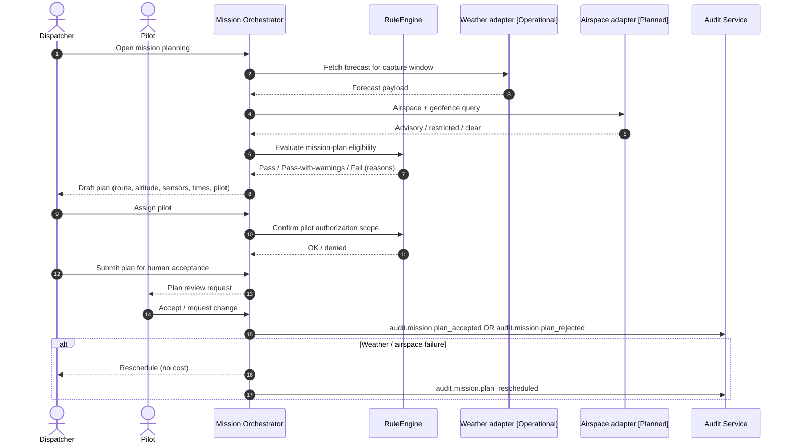

**Written explanation.**
Planning composes weather, airspace, geofence, equipment readiness, and pilot authorization into a single plan. `RuleEngine` returns a deterministic pass/warn/fail so decisions are auditable and not attributable to LLM hallucination. Pilot authorization is checked against attribute scopes (aircraft class, geography, night-flight qualification for AWE). Failure to secure any input reschedules without cost.

**Rejection paths.** Airspace restricted; unsuitable weather; no authorized pilot; equipment unavailable.

**Retry/recovery.** Reschedule loops back to Stage 2 with a preserved audit trail.

**Authorization boundary.** Dispatcher role; pilot required to accept plan.

**Audit events.** `audit.mission.plan_*`.

**Data written.** `mission_plans`, `mission_environment`, `mission_equipment`, `audit_events`.

**Durable events.** None. In-planning failures are recoverable and non-critical.

**Final state.** Mission advances to Stage 3 (Mission Validation) with a pilot-accepted plan.

---

## SD-005 — PREFLIGHT MISSION VALIDATION (ATC 20-ITEM GATE)

**Purpose.** Hard-stop or warn on any preflight condition that would compromise capture integrity or safety.
**Actors.** Pilot, Ground Station, Mission Orchestrator, Rule Engine, Audit Service.
**Preconditions.** SD-004 complete.
**Blueprint anchors.** §22 Stage 3, §5.1 (`RuleEngine`), §16 AWE eligibility.

```mermaid
sequenceDiagram
    autonumber
    actor Pilot
    participant GS as Ground Station [Planned]
    participant Mo as Mission Orchestrator
    participant Rules as RuleEngine
    participant Audit as Audit Service

    Pilot->>GS: Begin preflight
    GS->>Mo: Report drone health / battery / storage
    GS->>Mo: Report network + camera + thermal readiness
    GS->>Mo: Report sensor calibration state
    GS->>Mo: Report edge-compute readiness (Manifold / equivalent)
    GS->>Mo: Report environmental delta (AWE only)
    Mo->>Rules: Evaluate ATC 20-item gate
    Rules-->>Mo: Result (hard-stop / warning / pass)
    alt Hard-stop
        Mo-->>Pilot: Block flight; reasons
        Mo->>Audit: audit.mission.preflight_blocked
    else Warning
        Mo-->>Pilot: Warnings shown, pilot must acknowledge
        Pilot->>Mo: Acknowledge
        Mo->>Audit: audit.mission.preflight_warned
    else Pass
        Mo->>Audit: audit.mission.preflight_passed
    end
```

**Written explanation.**
Preflight is a deterministic gate — a fixed set of checks classified as *hard-stop* (fails abort) or *warning* (pilot must acknowledge). AWE-specific checks include the environmental temperature delta and interior thermal load; failing the delta blocks AWE capture without pilot override. Edge-compute readiness (Manifold or equivalent) is checked only when the product's processing plan requires local acceleration.

**Rejection paths.** Any hard-stop item. AWE eligibility failure. Missing calibration.

**Retry/recovery.** Preflight is re-runnable; each pass is a distinct row with a monotonic sequence number.

**Authorization boundary.** Pilot only. Override of a warning is a step-up event.

**Audit events.** `audit.mission.preflight_blocked | warned | passed`.

**Data written.** `mission_readiness_checks`, `audit_events`.

**Durable events.** None.

**Final state.** Mission enters Stage 4 (Flight) only after a `preflight_passed` or acknowledged `preflight_warned` result.

---

## SD-006 — FLIGHT AND LIVE MISSION ASSURANCE

**Purpose.** Execute capture with live coverage, image-quality, and thermal-quality monitoring; abort or request additional shots on the fly.
**Actors.** Pilot, Drone, Ground Station, Mission Orchestrator, Rule Engine, Audit Service.
**Preconditions.** SD-005 preflight passed.
**Blueprint anchors.** §22 Stages 4–5, §12 (twin), §14 (raw preservation).

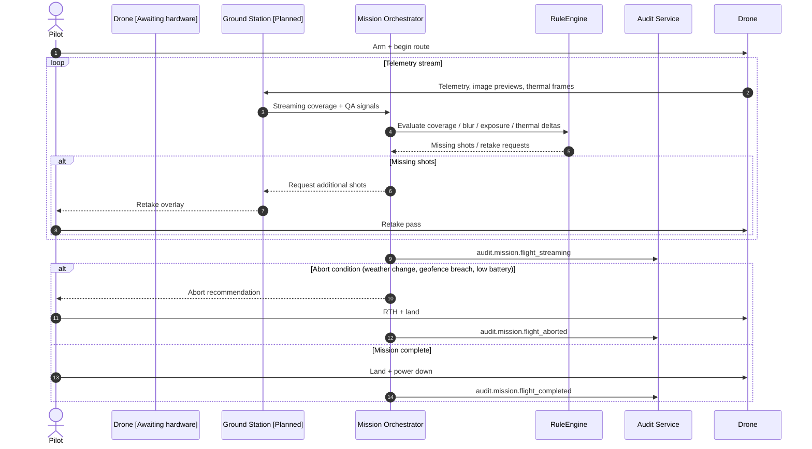

**Written explanation.**
Assurance runs in-flight — coverage, per-shot blur/exposure, thermal quality (drift, saturation, air-temperature stability). Any missing shot is inserted into a retake queue that the pilot can execute before returning to home. Abort conditions include environmental degradation, hard geofence breach, hardware fault, low battery, and operator judgment; all are captured with reason codes.

**Rejection paths.** Abort during flight → partial capture; retake queue unfulfillable.

**Retry/recovery.** Retake pass; if unrecoverable, mission is marked *insufficient evidence* and rescan policy applies (SD-020).

**Authorization boundary.** Pilot only.

**Audit events.** `audit.mission.flight_streaming | aborted | completed`.

**Data written.** `mission_flights`, `mission_telemetry`, `mission_failures` (on abort), `audit_events`.

**Durable events.** None during flight (real-time). Post-flight finalization emits `evidence.package_finalization_pending` (see SD-007).

**Final state.** Flight is *complete* or *aborted*. Mission advances to Stage 6 (Capture Validation) only on completion.

---

## SD-007 — CAPTURE FINALIZATION AND CANONICAL MISSION PACKAGE

**Purpose.** Assemble the immutable **canonical mission package** (§14) and register derivatives for downstream processing.
**Actors.** Ground Station, Evidence Service, Workflow State Machine, Durable Job / Transactional Outbox, Audit Service.
**Preconditions.** Flight completed (SD-006).
**Blueprint anchors.** §14 (raw preservation), §7.2 (durable outbox), §22 Stage 6.

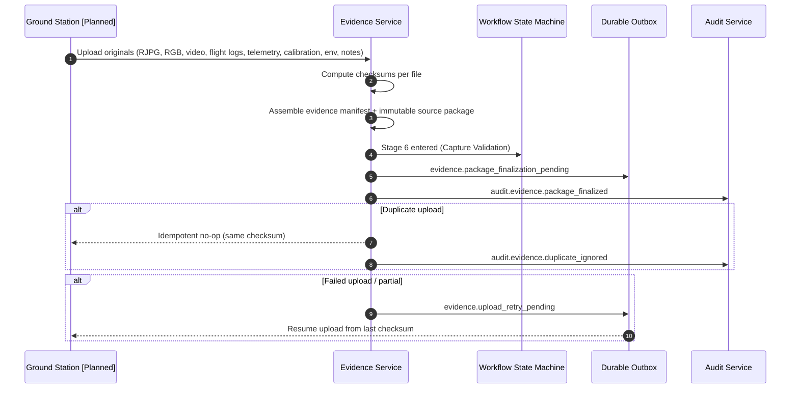

**Written explanation.**
Originals are stored *before* any derivative is created. Checksums make uploads idempotent (same content = same manifest). The evidence manifest records every file, checksum, and provenance so subsequent stages can prove they used the intended input. Partial uploads resume via checksum diff. Duplicates are silently accepted and re-linked to the existing manifest.

**Rejection paths.** Missing required originals; manifest checksum inconsistent; corrupted files.

**Retry/recovery.** Outbox job replays finalization on worker crash; upload resume for partial transfers.

**Authorization boundary.** Ground station identity bound to the mission. Post-finalization writes require workflow role.

**Idempotency.** Whole-manifest checksum used as the idempotency key.

**Audit events.** `audit.evidence.package_finalized | duplicate_ignored | upload_retry_pending`.

**Data written.** `evidence_manifests`, `evidence_items`, `evidence_files`, `evidence_checksums`, `evidence_metadata`, `evidence_calibrations`, `outbox_events`, `audit_events`.

**Durable events.** `evidence.package_finalization_pending`.

**Final state.** Mission at Stage 6 done, Stage 7 pending.

---

## SD-008 — DAYSCAN™ PROCESSING

**Purpose.** Generate the daylight measurement package: photogrammetric twin, measurement geometry, damage candidates, material quantities, risk-tier assignments, and roof/window/door findings.
**Actors.** Agent Orchestrator, `PhotogrammetryProvider` (primary + alternate), `MeasurementProvider`, `VisionProvider`, `SegmentationProvider`, `RuleEngine`, Human QA (Tier 2), Evidence Service, Workflow State Machine, Audit Service.
**Preconditions.** SD-007 complete for a DayScan mission.
**Blueprint anchors.** §12.1 (layered twin), §5 (capability providers), §10 (Tier 2), §22 Stage 7-9.

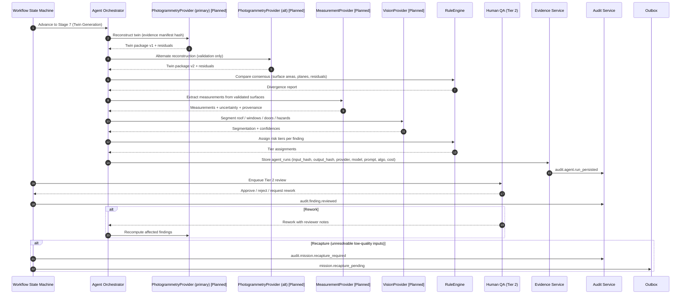

**Written explanation.**
Twin generation runs primary + alternate provider for consensus checking on high-stakes fields (surface area, plane counts). Measurements come from validated surfaces, not from raw pixels. `VisionProvider` and `SegmentationProvider` produce candidates that `RuleEngine` classifies into risk tiers per §10. Tier 2 human QA is mandatory before findings become releasable. **The system does not derive concealed structural elements from exterior RGB.**

**Rejection paths.** Insufficient coverage; unresolvable residuals; consensus divergence beyond threshold.

**Retry/recovery.** Rework loop for QA rejections; recapture path escalates to SD-020.

**Authorization boundary.** Agent Orchestrator + Tier 2 reviewer.

**Audit events.** `audit.agent.run_persisted`, `audit.finding.reviewed`, `audit.mission.recapture_required`.

**Data written.** `agent_runs`, `agent_run_inputs/outputs/costs/failures`, `evidence_derivatives`, `findings`, `finding_measurements`, `finding_classifications`, `finding_risk_tiers`, `finding_reviews`, `audit_events`.

**Durable events.** `mission.recapture_pending` when applicable.

**Final state.** DayScan findings tiered and reviewed; mission continues to Stage 12 (Report Generation) or, for Elite, awaits AWE completion (SD-010).

---

## SD-009 — AWE™ PROCESSING

**Purpose.** Deliver Air / Water / Energy intelligence from calibrated radiometric evidence with false-positive suppression, occlusion testing, and release-state gating for the AWE Index™.
**Actors.** Agent Orchestrator, `ThermalAnalysisProvider`, `CalibrationProvider`, `MeasurementProvider`, `RuleEngine`, Human QA (Tier 3), Evidence Service, Workflow State Machine, Audit Service.
**Preconditions.** SD-007 for an AWE-eligible mission with preserved radiometric originals (§14).
**Blueprint anchors.** §3 (AWE nav), §12.2 (calibrated thermal-to-3D), §17.1 (AWE Index release states), §10 Tier 3.

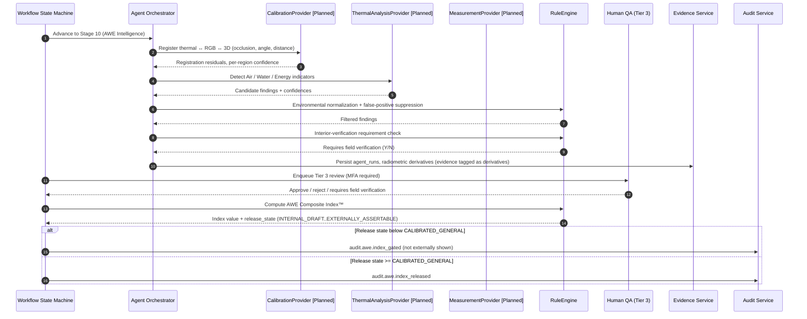

**Written explanation.**
The pipeline preserves radiometric originals and derives thermal findings only after calibrated projection onto validated 3D surfaces (§12.2). Occluded and grazing-angle observations are rejected. Environmental normalization runs before classification. Interior verification may be required for high-consequence findings. The AWE Composite Index™ can never be shown externally without its release-state chip (§17.1); below `CALIBRATED_GENERAL` it stays internal.

**Rejection paths.** Registration residual over threshold; environmental delta out of bounds after capture; contradictory Air/Water/Energy evidence beyond human-resolvable variance.

**Retry/recovery.** Rework loop; recapture on unresolvable registration.

**Authorization boundary.** Agent Orchestrator + Tier 3 MFA-authenticated reviewer.

**Audit events.** `audit.awe.index_gated | index_released`, `audit.finding.reviewed`.

**Data written.** `agent_runs`, `evidence_derivatives`, `findings`, `finding_evidence_links`, `finding_classifications`, `finding_reviews`, `audit_events`.

**Durable events.** Emits `finding.approved` for each approved finding (Blueprint §7.2 critical set).

**Final state.** AWE findings tiered/reviewed with release-state metadata attached to any composite indices.

---

## SD-010 — ELITE™ COMBINED PROCESSING

**Purpose.** Produce the unified Elite deliverable from a linked DayScan mission and AWE Scan mission on the same property.
**Actors.** Agent Orchestrator, `PhotogrammetryProvider`, `CalibrationProvider`, `RuleEngine`, Human QA (Tier 3), Workflow State Machine, Property Passport Service, Audit Service.
**Preconditions.** SD-008 approved, SD-009 approved, both bound to same canonical property identity.
**Blueprint anchors.** §16 (Elite product), §11 (Passport delta), §22.

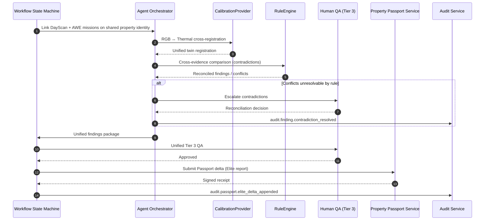

**Written explanation.**
Elite is not the union of two reports; it is a **reconciled** deliverable with contradiction analysis. Cross-registration guarantees findings from RGB and thermal reference the same coordinate system. Any contradictory evidence must be reconciled by Human QA (Tier 3). Only after reconciliation does the Passport receive a single Elite delta.

**Rejection paths.** Missing prerequisite mission approval; unresolved contradictions.

**Retry/recovery.** Reconciliation escalation loop.

**Authorization boundary.** Tier 3 reviewer.

**Audit events.** `audit.finding.contradiction_resolved`, `audit.passport.elite_delta_appended`.

**Data written.** `findings`, `finding_versions`, `passport_deltas`, `passport_entries`, `passport_receipts`, `audit_events`.

**Durable events.** `finding.approved` per approved finding; `passport.appended` post-commit (see SD-014).

**Final state.** Elite delta committed, Habitat sync pending (SD-015).

---

## SD-011 — AGENT CAPABILITY EXECUTION

**Purpose.** Standardize how *any* agent runs through the Agent Orchestrator: capability-interface selection, provider runtime configuration, input hashing, retries, fallbacks, and permanent `agent_runs` records.
**Actors.** Agent Orchestrator, Capability Providers, `RuleEngine` (validators), Human QA (on escalation), Audit Service.
**Preconditions.** A capability interface is invoked by an upstream stage.
**Blueprint anchors.** §5 (AI Workforce), §15 (provenance).

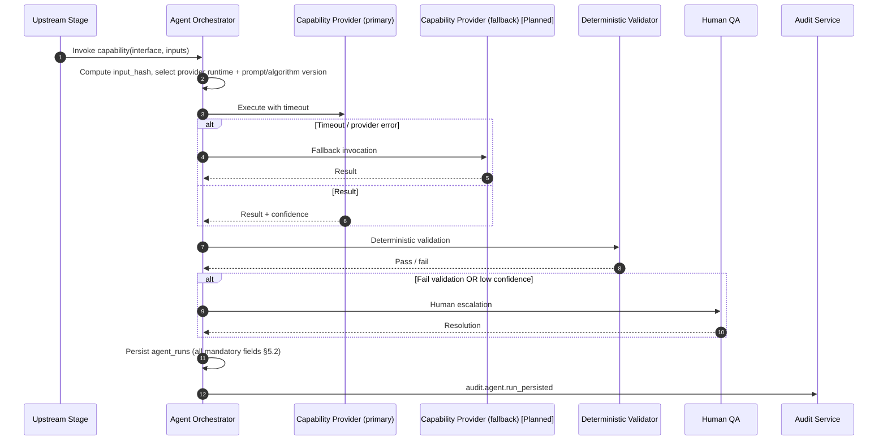

**Written explanation.**
No agent runs outside the Orchestrator. Every run records provider_id, provider_model, model_version, prompt_version, algorithm_id, algorithm_version, runtime_config_hash, input_hash, output_hash, cost, confidence, evidence_ids, provenance, implementation_state, verification_status. Fallbacks are provider-neutral: the interface is what upstream sees, never the vendor. LLM outputs pass deterministic validators before use; low-confidence results escalate to human review, not silent acceptance.

**Rejection paths.** Validator failure; safety violation; policy denial.

**Retry/recovery.** Bounded retries; then fallback provider; then human escalation.

**Authorization boundary.** Only the Agent Orchestrator may call providers.

**Audit events.** `audit.agent.run_persisted`, `audit.agent.escalated_to_human`.

**Data written.** `agent_runs`, `agent_run_inputs`, `agent_run_outputs`, `agent_run_costs`, `agent_run_failures`, `prompt_versions`, `algorithm_versions`, `validation_rules`, `audit_events`.

**Durable events.** None (invoked in-line by higher-level flows that may themselves be durable).

**Final state.** Permanent `agent_runs` record with full replay lineage.

---

## SD-012 — FINDING LIFECYCLE

**Purpose.** Move a finding through its states: candidate → evidence-linked → automated-informational → contractor-review → high-consequence-escalation → professionally-controlled-review → approved / rejected / superseded → customer-releasable → passport-eligible.
**Actors.** Agent Orchestrator, Contractor, Human QA (Tier 1–4), Engineer / Authorized Reviewer, Rule Engine, Audit Service.
**Preconditions.** A candidate finding exists in `findings`.
**Blueprint anchors.** §10 (tiers), §15 (provenance/verification), §11 (release rules).

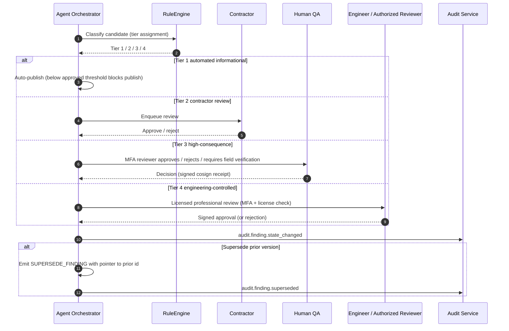

**Written explanation.**
Tier assignment is deterministic (RuleEngine) — LLMs do not assign tier. Tier 3 is *non-engineering high consequence*; anything touching structure, code compliance, engineering, or repair design escalates to Tier 4. Tier 4 requires a licensed professional; the system cannot self-approve Tier 4. Supersession preserves the prior version and points to it.

**Rejection paths.** Insufficient evidence; contradictory evidence; license failure on Tier 4.

**Retry/recovery.** Reopen finding with new evidence.

**Authorization boundary.** Contractor for Tier 2; MFA reviewer for Tier 3; licensed professional for Tier 4.

**Audit events.** `audit.finding.state_changed`, `audit.finding.superseded`.

**Data written.** `findings`, `finding_versions`, `finding_evidence_links`, `finding_reviews`, `finding_approvals`, `finding_supersessions`, `finding_release_restrictions`, `audit_events`.

**Durable events.** `finding.approved` on Tier 3/4 approvals bound for Passport.

**Final state.** Finding is releasable, passport-eligible, or rejected/superseded.

---

## SD-013 — REPORT GENERATION

**Purpose.** Assemble the DayScan / AWE / Elite report from approved findings, evidence, and twin snapshots, and produce a hashed PDF plus a Reports Binder.
**Actors.** Report Service, Evidence Service, Property Passport Service, Human QA, Audit Service.
**Preconditions.** Findings approved through SD-012.
**Blueprint anchors.** §22 Stage 12, §14 (evidence), §12 (twin), §20.1 (Phase 1 chip rules).

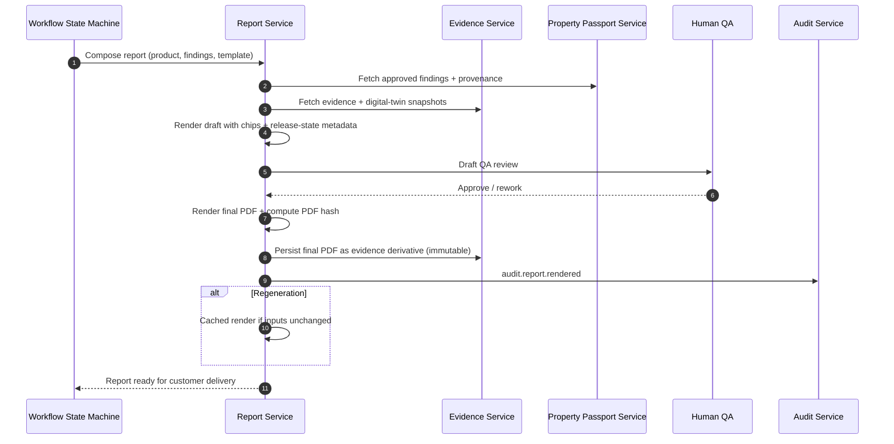

**Written explanation.**
Reports use only *releasable* findings. Every non-real value in Phase 1 carries a chip per §20.1. The final PDF hash is stored in evidence so a customer copy can be verified against the canonical rendering. Regeneration reuses cached renders when inputs are unchanged, keyed by a canonical inputs hash.

**Rejection paths.** Missing releasable findings; template mismatch; QA rejection.

**Retry/recovery.** Idempotent regeneration keyed by inputs hash.

**Authorization boundary.** QA role.

**Audit events.** `audit.report.rendered | reworked | regenerated`.

**Data written.** `evidence_derivatives` (PDF), `finding_release_restrictions`, `audit_events`.

**Durable events.** `report.generation_pending` while queued; concluded on `report.rendered`.

**Final state.** Report is releasable to customer via SD-015.

---

## SD-014 — PASSPORT APPEND AND SIGNED RECEIPT

**Purpose.** Append an inspection delta to the canonical Passport ledger under optimistic concurrency with explicit rebase, and issue a signed receipt.
**Actors.** Workflow State Machine, Property Passport Service, Human QA (on conflict), Durable Outbox, Audit Service.
**Preconditions.** Approved findings bound for the ledger.
**Blueprint anchors.** §11 (Passport), §11.1 (rebase), §7.2 (outbox).

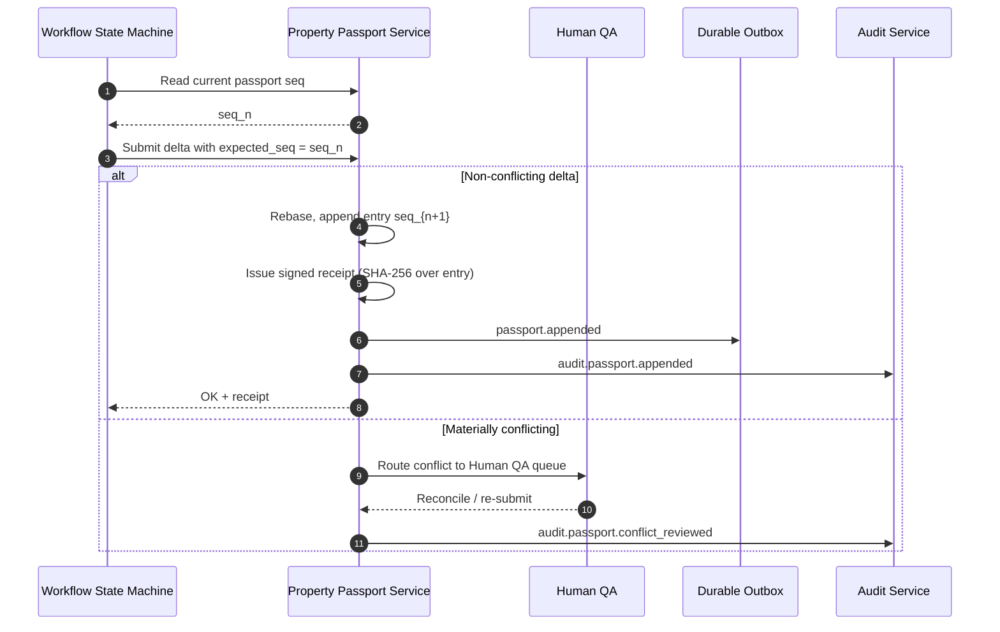

**Written explanation.**
Only the Passport authority writes to Passport history. Non-conflicting deltas are rebased automatically. Materially conflicting deltas never overwrite; they queue for reconciliation with both attempted submissions preserved. Every accepted append yields a signed receipt used for downstream verification (SD-017 co-sign uses the receipt).

**Rejection paths.** Signature failure; ownership mismatch; delta invalidation.

**Retry/recovery.** Losing submissions are queued and surfaced to the submitter with a rebase link.

**Idempotency.** Delta submission is keyed by `{finding_id, inspection_id, expected_seq}`; duplicate submissions collapse to a single accepted entry.

**Authorization boundary.** Passport authority only writes; upstream roles submit.

**Audit events.** `audit.passport.appended`, `audit.passport.conflict_reviewed`.

**Data written.** `passports`, `passport_sequences`, `passport_entries`, `passport_deltas`, `passport_receipts`, `passport_conflicts`, `passport_rebases`, `outbox_events`, `audit_events`.

**Durable events.** `passport.appended`.

**Final state.** Ledger has entry seq_{n+1}; downstream Habitat sync pending.

---

## SD-015 — HABITAT SYNCHRONIZATION

**Purpose.** Project the newly appended Passport entry into homeowner-safe form and deliver to Stratex Habitat with acknowledgment, retry, and dead-letter handling.
**Actors.** Property Passport Service, Habitat Synchronization Service, Stratex Habitat, Durable Outbox, Notification Service, Audit Service.
**Preconditions.** `passport.appended` event on the outbox.
**Blueprint anchors.** §8 (sync), §7.2 (durable).

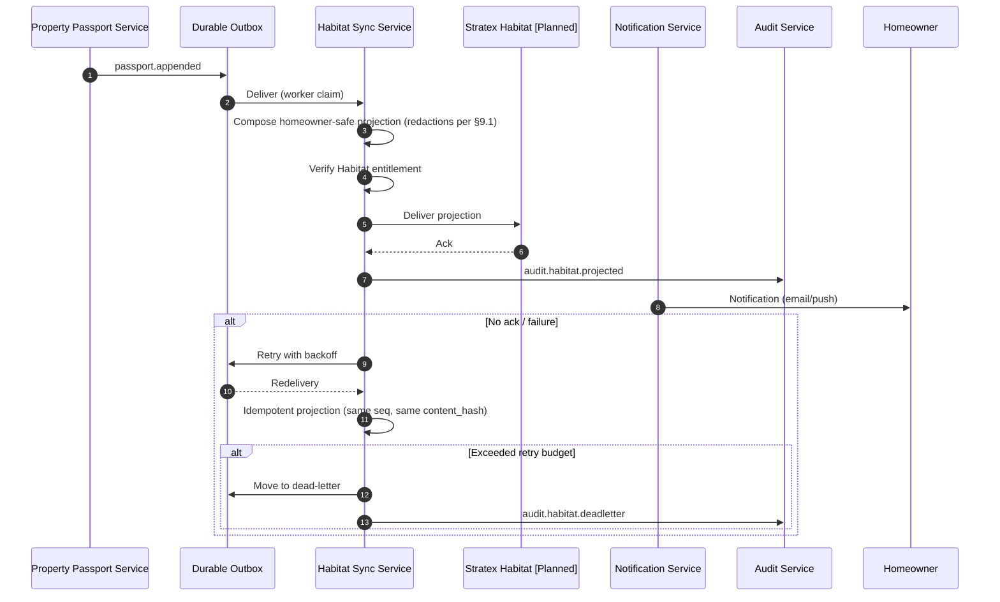

**Written explanation.**
Habitat receives read-only projections; it *never* mutates Passport history. Projections are entitlement-scoped (product entitlement determines which layers homeowners see). Delivery is at-least-once with idempotent handlers on the Habitat side. Failures escape to dead-letter with human replay.

**Rejection paths.** Missing entitlement; homeowner not linked to property (SD-019).

**Retry/recovery.** Bounded exponential retries then dead-letter.

**Authorization boundary.** Sync service. Habitat has read-only access to projections it received.

**Audit events.** `audit.habitat.projected | deadletter | replayed`.

**Data written.** `passport_projections`, `outbox_events`, `dead_letter_events`, `inbox_receipts`, `audit_events`.

**Durable events.** `habitat.ack_pending`.

**Final state.** Projection delivered, homeowner notified.

---

## SD-016 — CLAIM SNAPSHOT

**Purpose.** Freeze a hash-verifiable point-in-time slice of a Passport for insurance/claim use with expiring signed access and redaction rules.
**Actors.** Authorized Claim Initiator (contractor/homeowner/adjuster with claim right), Property Passport Service, Evidence Service, Audit Service.
**Preconditions.** Passport exists for the property; claim initiator authorized.
**Blueprint anchors.** §9 (security), §11 (passport), §16 (product entitlement).

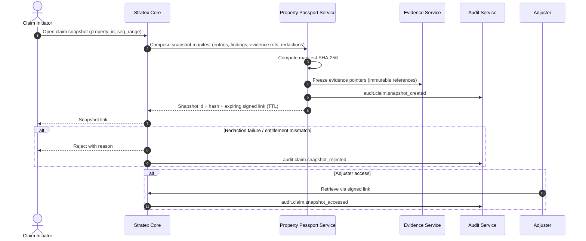

**Written explanation.**
A snapshot is immutable and hash-verifiable; it is *not* a new Passport entry — it's a projection with a frozen manifest. Access uses expiring signed links per §9.1. Redaction rules apply per audience (adjuster vs insurer vs claim initiator). Snapshot access is logged on every retrieval.

**Rejection paths.** Missing entitlement; policy denial; expired seq range.

**Retry/recovery.** Regenerate signed link (new TTL) without recomputing the manifest.

**Authorization boundary.** Claim initiator + adjuster; step-up MFA required.

**Audit events.** `audit.claim.snapshot_created | accessed | rejected`.

**Data written.** `claim_snapshots`, `passport_access_grants`, `audit_events`, `audit_access_events`.

**Durable events.** None.

**Final state.** Frozen manifest with SHA-256, accessible to entitled adjuster via signed URL.

---

## SD-017 — ADJUSTER CO-SIGN

**Purpose.** Bind an adjuster's identity to a claim decision (approve / reject / request correction) with SHA-256 co-sign receipt that appends to the ledger and updates the Reports Binder.
**Actors.** Adjuster, Property Passport Service, Audit Service, Authorization Service, Notification Service.
**Preconditions.** SD-016 snapshot exists; adjuster is authorized on the claim.
**Blueprint anchors.** §9.2 (MFA + step-up), §11 (Passport ledger).

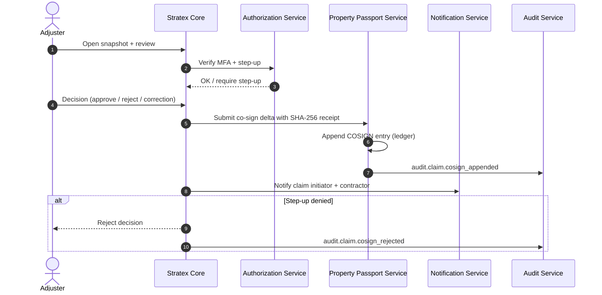

**Written explanation.**
Adjuster identity is verified with MFA and step-up for the signature action. The co-sign is a distinct ledger entry with its own SHA-256, referencing the snapshot hash. Notifications go to claim initiator and contractor. The Reports Binder is updated to include the co-sign receipt.

**Rejection paths.** Failed step-up; expired snapshot; superseded snapshot.

**Retry/recovery.** New signature attempt on refreshed link.

**Authorization boundary.** Adjuster role with claim binding.

**Audit events.** `audit.claim.cosign_appended | rejected`.

**Data written.** `adjuster_cosigns`, `passport_entries`, `passport_receipts`, `audit_events`.

**Durable events.** `passport.appended` (co-sign entry).

**Final state.** Ledger contains cosign entry; Reports Binder updated; parties notified.

---

## SD-018 — PROPERTY CORRECTION AND FINDING SUPERSESSION

**Purpose.** Correct an incorrect finding or property field via SUPERSEDE while preserving prior history.
**Actors.** Contractor / Reviewer, Human QA (Tier match to original), Property Passport Service, Habitat Sync Service, Audit Service.
**Preconditions.** Prior entry exists to be superseded.
**Blueprint anchors.** §11.2 (identity), §11.3 (operations), §15 (provenance).

```mermaid
sequenceDiagram
    autonumber
    actor Requester as Reporter
    participant Core as Stratex Core
    participant QA as Human QA
    participant Pass as Property Passport Service
    participant Sync as Habitat Sync Service
    participant Audit as Audit Service

    Requester->>Core: Report incorrect finding / field with evidence
    Core->>QA: Route to reviewer of matching tier
    QA-->>Core: Approve correction / reject
    alt Approved
        Core->>Pass: Emit SUPERSEDE_FINDING entry (points to prior seq/hash)
        Pass->>Pass: Append new canonical value; prior version preserved
        Pass-->>Core: New signed receipt
        Core->>Sync: Trigger Habitat projection update
        Core->>Audit: audit.finding.superseded
    else Rejected
        Core->>Audit: audit.finding.correction_rejected
    end
```

**Written explanation.**
Corrections are never destructive. The prior entry remains; the SUPERSEDE entry points at it and carries the new value. The Habitat projection re-computes so homeowners see the corrected state, but historical read-access retains the prior state. Approval tier matches the original finding tier.

**Rejection paths.** Insufficient evidence; wrong tier.

**Retry/recovery.** Reopen with additional evidence.

**Authorization boundary.** Reviewer role matching the prior tier.

**Audit events.** `audit.finding.superseded | correction_rejected`.

**Data written.** `finding_supersessions`, `passport_entries`, `passport_receipts`, `audit_events`.

**Durable events.** `passport.appended`.

**Final state.** New canonical value active; prior preserved.

---

## SD-019 — PROPERTY SPLIT, MERGE, LINK, UNLINK, OWNERSHIP TRANSFER

**Purpose.** Model first-class property identity operations while preserving history.
**Actors.** Reviewer (Tier 2 or Tier 3 per operation), Property Passport Service, Habitat Sync Service, Notification Service, Audit Service.
**Preconditions.** Human authorization at the required tier.
**Blueprint anchors.** §11.3.

```mermaid
sequenceDiagram
    autonumber
    actor Reviewer
    participant Core as Stratex Core
    participant Pass as Property Passport Service
    participant Sync as Habitat Sync Service
    participant Notif as Notification Service
    participant Audit as Audit Service

    Reviewer->>Core: Choose operation (LINK / UNLINK / MERGE / SPLIT / ADDRESS_CORRECTION / PARCEL_CORRECTION / OWNERSHIP_TRANSFER)
    Core->>Pass: Validate preconditions (identity operations require Tier 3; LINK/UNLINK Tier 2; OWNERSHIP MFA)
    alt MERGE
        Pass->>Pass: Emit IDENTITY_MERGE entry (aliases retiring id)
    else SPLIT
        Pass->>Pass: Emit IDENTITY_SPLIT (two Passports inherit provenance)
    else LINK
        Pass->>Pass: Emit IDENTITY_LINK
    else UNLINK
        Pass->>Pass: Emit IDENTITY_UNLINK
    else ADDRESS_CORRECTION / PARCEL_CORRECTION
        Pass->>Pass: SUPERSEDE property_addresses / property_parcels
    else OWNERSHIP_TRANSFER
        Pass->>Pass: Append owners record; rebind property_org_bindings
        Pass->>Notif: Notify homeowner via Habitat
    end
    Pass-->>Reviewer: New receipt + preserved prior history
    Pass->>Sync: Trigger Habitat projection updates
    Pass->>Audit: audit.property.identity_operation
```

**Written explanation.**
Every operation is authorized, reviewed, and yields new ledger entries with `supersedes` / `succeeds` pointers. Reversal within a documented rollback window is a new SUPERSEDE, not a rewrite. Ownership transfer is never a new property; it is a rebinding.

**Rejection paths.** Wrong tier; conflicting active operation; open dispute.

**Retry/recovery.** Rollback within window via SUPERSEDE.

**Authorization boundary.** Tier 2 for LINK/UNLINK/OWNERSHIP; Tier 3 for MERGE/SPLIT; MFA for OWNERSHIP.

**Audit events.** `audit.property.identity_operation` with operation kind.

**Data written.** `passport_identity_operations`, `passport_entries`, `passport_receipts`, `property_ownership_periods`, `property_relationships`, `audit_events`.

**Durable events.** `passport.appended` per entry.

**Final state.** Identity graph updated; prior state preserved.

---

## SD-020 — FAILED MISSION AND RESCAN

**Purpose.** Classify a failed mission, apply pricing/rescan policy, adjust the cost ledger, and preserve failed-mission evidence.
**Actors.** Pilot / Dispatcher, Mission Orchestrator, Cost Ledger, Rule Engine, Notification Service, Audit Service.
**Preconditions.** A mission enters a failure state.
**Blueprint anchors.** §16 (rescan/failed policy), §22 Stage 5–6.

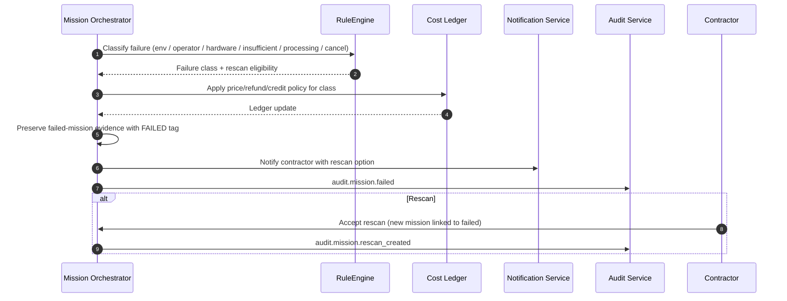

**Written explanation.**
Failure is a first-class state with a classification vocabulary. Evidence from failed missions is preserved (not deleted) — it is still evidence. Rescan creates a new linked mission with the correct pricing per class.

**Rejection paths.** Rescan window expired; org billing hold.

**Retry/recovery.** Manual dispute route.

**Authorization boundary.** Dispatcher; contractor accepts rescan.

**Audit events.** `audit.mission.failed | rescan_created`.

**Data written.** `mission_failures`, `mission_rescans`, `mission_costs`, `audit_events`.

**Durable events.** None.

**Final state.** Failed mission archived; optional rescan queued.

---

## SD-021 — DATA RETENTION AND LEGAL HOLD

**Purpose.** Enforce §13 retention classes, legal-hold overrides, PII correction, secure deletion, and history preservation.
**Actors.** Retention Worker, Evidence Service, Property Passport Service, Legal Hold Officer (role), Audit Service.
**Preconditions.** Data class assigned at write time.
**Blueprint anchors.** §13.

```mermaid
sequenceDiagram
    autonumber
    participant W as Retention Worker
    participant Ev as Evidence Service
    participant Pass as Property Passport Service
    participant Legal as Legal Hold Officer
    participant Audit as Audit Service

    W->>Ev: Scan for hot-to-cold transitions per class
    Ev-->>W: Candidates
    W->>Ev: Transition hot → cold (encrypted)
    Ev->>Audit: audit.evidence.tier_transitioned
    alt Legal hold
        Legal->>Ev: Apply hold (freeze deletion)
        Ev->>Audit: audit.legal_hold.applied
    end
    alt Customer deletion request
        Customer->>Core: Request PII deletion
        Core->>Pass: SUPERSEDE PII fields with tombstones
        Core->>Ev: Crypto-shred keys for tombstoned records
        Core->>Audit: audit.retention.deletion_processed
    end
    alt Hold release
        Legal->>Ev: Release hold
        Ev->>Audit: audit.legal_hold.released
    end
```

**Written explanation.**
Retention is class-driven and automated. Passport history is preserved; only PII fields become tombstones on deletion. Legal hold overrides retention deletion; hold release re-enables scheduled deletion. Secure deletion is crypto-shred on tombstone.

**Rejection paths.** Deletion attempt on held record; PII correction without authorization.

**Retry/recovery.** Idempotent retention job; re-runs skip transitioned records.

**Authorization boundary.** Retention worker (service identity) + legal role.

**Audit events.** `audit.evidence.tier_transitioned`, `audit.legal_hold.*`, `audit.retention.deletion_processed`.

**Data written.** `evidence_retention_actions`, `legal_holds`, `audit_events`.

**Durable events.** None.

**Final state.** Retention class enforced; ledger history preserved.

---

## SD-022 — PUBLIC OR THIRD-PARTY PASSPORT PROJECTION

**Purpose.** Serve narrowly scoped, revocable, rate-limited public projections through expiring signed links — never through the permanent Passport identifier.
**Actors.** Passport Owner (grantor), Recipient, Authorization Service, Property Passport Service, Audit Service.
**Preconditions.** Grantor authorized.
**Blueprint anchors.** §9.1.

```mermaid
sequenceDiagram
    autonumber
    actor Grantor
    actor Recipient
    participant Core as Stratex Core
    participant AuthZ as Authorization Service
    participant Pass as Property Passport Service
    participant Audit as Audit Service

    Grantor->>Core: Grant projection (audience, scope, TTL, binding)
    Core->>AuthZ: Authorize grant
    AuthZ-->>Core: OK
    Pass->>Pass: Compose scoped projection (redactions per audience)
    Pass-->>Core: Signed expiring link
    Core-->>Recipient: Link (email/portal)
    Recipient->>Core: Retrieve link
    Core->>Pass: Verify signature + kill-list + rate-limit + binding
    Pass-->>Core: Projection payload
    Core->>Audit: audit.passport.public_access
    alt Revocation
        Grantor->>Core: Revoke grant
        Core->>Pass: Add to kill-list
        Core->>Audit: audit.passport.access_revoked
    end
```

**Written explanation.**
The permanent Passport identifier hash is never a bearer credential. All external access flows through short-lived signed URLs, audience-scoped payloads, and revocable kill-list checks. Every retrieval is audited.

**Rejection paths.** Expired link; revoked; rate-limit hit; binding mismatch.

**Retry/recovery.** New grant with new link.

**Authorization boundary.** Grantor role; MFA required per §9.2.

**Audit events.** `audit.passport.public_access`, `audit.passport.access_revoked`.

**Data written.** `passport_access_grants`, `audit_access_events`, `audit_events`.

**Durable events.** None.

**Final state.** Recipient obtained a scoped payload once, subject to rate limits and revocation.

---

## SD-023 — DURABLE-EVENT RECOVERY

**Purpose.** Guarantee at-least-once delivery of critical events across process restart, deploy, network interruption, worker failure, and duplicate delivery.
**Actors.** Any Producer, Transactional Outbox, Worker, Consumer (Inbox), Dead-Letter Queue, Audit Service.
**Preconditions.** A critical event set defined in Blueprint §7.2.
**Blueprint anchors.** §7.2.

```mermaid
sequenceDiagram
    autonumber
    participant P as Producer
    participant Db as Database
    participant Ob as Outbox
    participant W as Worker
    participant C as Consumer
    participant DL as Dead-Letter Queue
    participant Audit as Audit Service

    P->>Db: Write business record + outbox row (single transaction)
    Ob->>W: Worker claims outbox row (lease + lock)
    W->>C: Deliver event
    C->>Db: Idempotent apply (inbox receipt keyed by event id + hash)
    C-->>W: Ack
    W->>Ob: Mark delivered
    Ob->>Audit: audit.outbox.delivered
    alt Duplicate delivery
        C-->>W: Idempotent no-op (same inbox receipt)
    end
    alt Retry exhausted
        W->>DL: Move to dead-letter
        DL->>Audit: audit.outbox.deadletter
    end
    alt Manual replay
        Operator->>DL: Replay
        DL->>W: Re-emit
    end
```

**Written explanation.**
Outbox row and business row commit together — no lost events on crash. Workers lease rows with visibility timeouts so double-workers don't double-deliver. Consumers keep idempotency receipts keyed by event id + payload hash. Retries are bounded; failures go to dead-letter and require operator replay.

**Rejection paths.** Non-idempotent consumer (design defect).

**Retry/recovery.** Bounded exponential backoff; dead-letter; manual replay.

**Authorization boundary.** Service identities only; operator required for dead-letter replay.

**Audit events.** `audit.outbox.delivered | deadletter | replayed`.

**Data written.** `outbox_events`, `inbox_receipts`, `dead_letter_events`, `idempotency_records`, `audit_events`.

**Durable events.** This *is* the durable-event mechanism.

**Final state.** Every critical event either delivered idempotently or held in dead-letter for operator attention.

---

## SD-024 — END-TO-END 15-STAGE OPERATIONAL WORKFLOW

**Purpose.** Executive-level trace through all 15 stages showing owner, input, output, transition, failure path, human gate, audit event, durable event per stage.
**Actors.** All prior actors.
**Blueprint anchors.** §22 (stage table).

```mermaid
sequenceDiagram
    autonumber
    participant S1 as 1. Mission Control
    participant S2 as 2. Mission Planning
    participant S3 as 3. Mission Validation
    participant S4 as 4. Flight
    participant S5 as 5. Mission Assurance
    participant S6 as 6. Capture Validation
    participant S7 as 7. Digital Twin Generation
    participant S8 as 8. AI Workforce Processing
    participant S9 as 9. Property Intelligence
    participant S10 as 10. AWE Intelligence
    participant S11 as 11. Human QA
    participant S12 as 12. Report Generation
    participant S13 as 13. Passport Update
    participant S14 as 14. Habitat Sync
    participant S15 as 15. Customer Delivery

    S1->>S2: mission.created
    S2->>S3: plan.accepted
    S3->>S4: preflight.passed
    S4->>S5: flight.telemetry_stream
    S5->>S6: flight.completed
    S6->>S7: evidence.package_finalization_pending
    S7->>S8: twin.ready
    S8->>S9: findings.candidate
    S9->>S10: property_intelligence.ready
    S10->>S11: awe.candidates_ready
    S11->>S12: findings.approved
    S12->>S13: report.rendered
    S13->>S14: passport.appended
    S14->>S15: habitat.projected + notification.sent
```

**Written explanation — per stage.**

| # | Stage | Owner | Input | Output | Transition | Failure path | Human gate | Audit event | Durable event |
|---|---|---|---|---|---|---|---|---|---|
| 1 | Mission Control | Operator/dispatcher | Property id, product | Mission id | → Stage 2 | Ineligibility | — | `audit.mission.created` | — |
| 2 | Mission Planning | Mission Ops Service | Mission, weather, airspace | Plan | → Stage 3 | Reschedule | Pilot accept | `audit.mission.plan_*` | — |
| 3 | Mission Validation | RuleEngine | Preflight signals | Pass/warn | → Stage 4 | Hard-stop | Pilot ack of warning | `audit.mission.preflight_*` | — |
| 4 | Flight | Pilot + Drone | Plan | Telemetry + imagery | → Stage 5 | Abort → SD-020 | Pilot judgment | `audit.mission.flight_*` | — |
| 5 | Mission Assurance | Mission Ops | Live signals | Coverage + retakes | → Stage 6 | Insufficient evidence → SD-020 | Pilot retake ack | `audit.mission.flight_streaming` | — |
| 6 | Capture Validation | Capture Validation agent | Package | Immutable manifest | → Stage 7 | Failed manifest → SD-020 | — | `audit.evidence.package_finalized` | `evidence.package_finalization_pending` |
| 7 | Digital Twin Generation | Photogrammetry + Calibration | Manifest | Twin package | → Stage 8 | Recapture | — | `audit.agent.run_persisted` | — |
| 8 | AI Workforce Processing | Agent Orchestrator | Twin + evidence | Candidate findings | → Stage 9 | Escalate | — | `audit.agent.run_persisted` | — |
| 9 | Property Intelligence | Vision Intelligence | Findings | Roof/walls/openings | → Stage 10 or 11 | Rework | — | `audit.finding.state_changed` | — |
| 10 | AWE Intelligence | AWE Intelligence | Thermal + registration | AWE findings + index (gated) | → Stage 11 | Rework | Tier 3 | `audit.awe.*` | `finding.approved` |
| 11 | Human QA | Reviewers | Candidates | Approved findings | → Stage 12 | Rework / rejection | Tier 1–4 per §10 | `audit.finding.reviewed` | `finding.approved` |
| 12 | Report Generation | Report Service | Approved findings | Report PDF (hashed) | → Stage 13 | Rework | QA | `audit.report.rendered` | `report.generation_pending` |
| 13 | Passport Update | Passport Service (only writer) | Delta | Ledger entry + receipt | → Stage 14 | Conflict → QA | Conflict review | `audit.passport.appended` | `passport.appended` |
| 14 | Habitat Sync | Habitat Sync agent | passport.appended | Projection delivered | → Stage 15 | Dead-letter | Operator replay | `audit.habitat.*` | `habitat.ack_pending` |
| 15 | Customer Delivery | Delivery Service | Report + projection | Customer artifacts (report, passport link, notification) | terminus | Regenerate report | — | `audit.delivery.completed` | — |

**Final state.** Customer has received report, Passport is updated with signed receipt, Habitat projection is delivered, all audits written, all durable events acknowledged.

---

## §25 — TRACEABILITY MATRIX (SEQUENCE DIAGRAM → BLUEPRINT / DATA / AUDIT / DURABLE / ROLE)

*Full entity mapping (SD → entities read/written) is expressed in the Canonical Data Model v1.0 §12 cross-artifact matrix. This section is the SD-side of the same matrix.*

| SD | Blueprint anchor | Primary domain(s) written | Key audit event(s) | Durable event(s) | Required role |
|---|---|---|---|---|---|
| SD-001 | §9.2, §9.3, §20 | Tenants, Audit | org.created, user.invited, role_assigned, mfa_enrolled | — | admin |
| SD-002 | §11.2, §11.3 | Properties, Passports (receipt), Audit | property.identity_* | — | contractor / inspector / reviewer |
| SD-003 | §16 | Missions, Cost Ledger, Audit | mission.created | — | contractor |
| SD-004 | §22.2, §5.1 | Missions, Environment, Equipment, Audit | mission.plan_* | — | dispatcher, pilot |
| SD-005 | §22.3, §5.1 | Mission readiness, Audit | mission.preflight_* | — | pilot |
| SD-006 | §22.4-5, §12, §14 | Mission flights, telemetry, failures, Audit | mission.flight_* | — | pilot |
| SD-007 | §14, §7.2 | Evidence, Outbox, Audit | evidence.package_finalized | evidence.package_finalization_pending | ground station svc |
| SD-008 | §22.7-9, §5, §10 | Agents, Evidence, Findings, Audit | agent.run_persisted, finding.reviewed | mission.recapture_pending (on failure) | tier 2 reviewer |
| SD-009 | §12.2, §17.1, §10 | Agents, Evidence, Findings, Audit | awe.index_gated | finding.approved | tier 3 reviewer |
| SD-010 | §16 (Elite), §11 | Findings, Passports, Audit | finding.contradiction_resolved, passport.elite_delta_appended | finding.approved, passport.appended | tier 3 reviewer |
| SD-011 | §5, §15 | Agents, Audit | agent.run_persisted, agent.escalated | — | orchestrator svc |
| SD-012 | §10, §15, §11 | Findings, Audit | finding.state_changed, finding.superseded | finding.approved | tier 2/3/4 |
| SD-013 | §22.12, §14, §20.1 | Evidence, Audit | report.rendered | report.generation_pending | QA |
| SD-014 | §11, §11.1, §7.2 | Passports, Outbox, Audit | passport.appended | passport.appended | passport svc |
| SD-015 | §8, §7.2 | Passports (projection), Outbox, DLQ, Audit | habitat.projected/deadletter | habitat.ack_pending | sync svc |
| SD-016 | §9, §11, §16 | Passports (snapshot), Audit | claim.snapshot_* | — | claim initiator + adjuster |
| SD-017 | §9.2, §11 | Passports (cosign), Audit | claim.cosign_* | passport.appended | adjuster (MFA) |
| SD-018 | §11.2-3, §15 | Findings, Passports, Audit | finding.superseded | passport.appended | tier-matched reviewer |
| SD-019 | §11.3 | Passports (identity ops), Properties, Audit | property.identity_operation | passport.appended | tier 2/3 per op |
| SD-020 | §16, §22.5-6 | Missions, Cost Ledger, Audit | mission.failed, rescan_created | — | dispatcher |
| SD-021 | §13 | Evidence, Legal Holds, Passports (tombstones), Audit | retention.*, legal_hold.* | — | retention svc + legal officer |
| SD-022 | §9.1 | Passports (access grants), Audit | passport.public_access | — | grantor (MFA) |
| SD-023 | §7.2 | Outbox, DLQ, Idempotency, Audit | outbox.* | (is the mechanism) | service identities + operator |
| SD-024 | §22 | All | See stage table | See stage table | See stage table |

---

## §26 — ARCHITECTURE CONFLICT REPORT

No flow in this pack requires modification of Blueprint v1.2. Two items are flagged for **executive review** as observations, not corrections, because they may become conflicts once the Canonical Data Model is written.

**Observation A — Passport authority boundary vs. co-sign entries.**
Blueprint §11 states the Passport Service is the sole writer of canonical Passport history. SD-017 (Adjuster Co-Sign) appends a `COSIGN` entry to the ledger. This is compatible: the adjuster's *decision* is authored by the adjuster; the *ledger append* is executed by the Passport Service on the adjuster's behalf. Documented explicitly to prevent future misinterpretation.

**Observation B — AWE Index™ persistence during pre-`CALIBRATED_GENERAL` states.**
Blueprint §17.1 forbids external display of the Index before `CALIBRATED_GENERAL`. The data model must therefore support persisting the Index with `release_state` metadata but exclude it from any projection composer that lacks a release-state override. Data-model draft addresses this in the Passport projections domain.

**No modification to Blueprint v1.2 is proposed by this pack.**

---

## §27 — CONFIRMATIONS

1. Blueprint v1.0, v1.1, and v1.2 remain unchanged. Files in `/app/memory/` are untouched by this pack.
2. Production remains untouched. No API endpoint, database schema, or deployment artifact was modified.
3. Legacy remains frozen. No file under legacy scope was modified.
4. No implementation code was written. No database migration was authored.
5. Phase 1a authorization remains withheld. Phase 1b/1c/1d/2/3/4/5 authorization remains withheld.
6. No new integrations were added. Every external system referenced is marked with its Blueprint §15.2 implementation state.

---

## §28 — REVISION HISTORY

| Version | Date | Author | Change summary |
|---|---|---|---|
| 1.0 | February 26, 2026 | TC | Initial Sequence Diagrams Pack. 24 diagrams. Aligned to Blueprint v1.2. |

**End of Sequence Diagrams Pack v1.0.**
